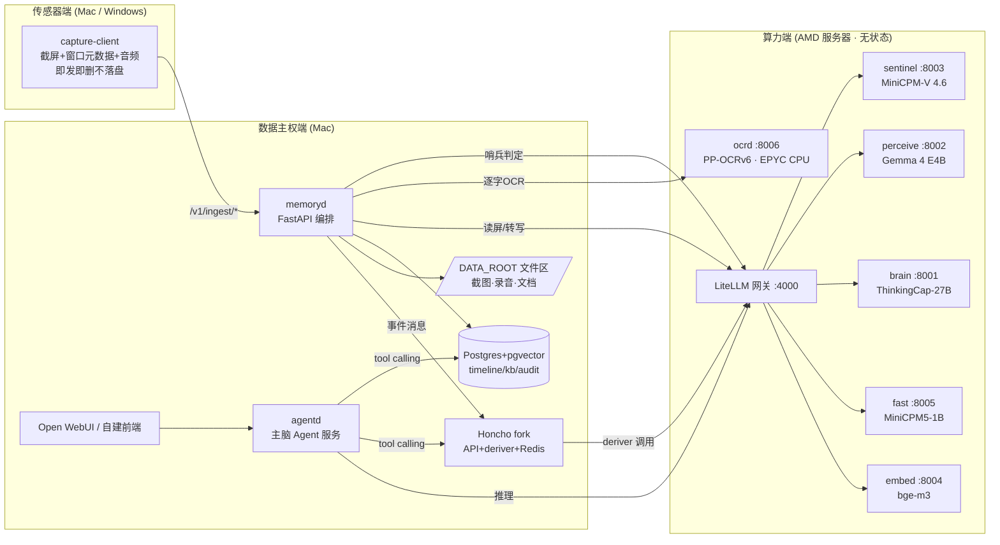

# DejaView 执行手册(交付给执行 Agent 的完整规格)

> 项目代号 **DejaView**(déjà vu + view:你的机器替你"似曾相识")。中文叙事名:**全本地数字记忆体**。
> 本手册是唯一事实来源(single source of truth)。执行 Agent 领取任务前必须通读第 0–4 节,再跳到自己任务所在小节。
> 版本:v1.0 · 2026-07-20 · 维护人:Wu

---

## 0. 给执行 Agent 的公共约定

- **语言**:代码/注释/commit 用英文,面向评委的 README 提供中英双语。
- **技术栈**:Python 3.12 + uv + ruff + pydantic v2 + FastAPI。所有服务容器化(docker compose)。
- **秘密与隐私**:任何 API key、真实个人数据(姓名/IP/聊天内容)不得写入代码、测试样例、提示词示例。测试用合成数据。
- **不确定就标注**:凡本手册标注 `[VERIFY]` 的事项,执行时先做小实验验证,把结论写进 `docs/verification-log.md` 再继续。
- **完成报告模板**(每个任务结束时提交):
  1. 任务 ID 与一句话结果;2. 运行过的关键命令与输出路径;3. 验收标准逐条核对;4. 偏离手册的决定及原因;5. 新发现的风险。
- **任务状态**:唯一以仓库根 `TASKBOARD.json` 为准(状态机 `false → doing → accept`,另有 `blocked`;领取与断点恢复协议见该文件 instructions);状态变更必须随任务产物同一个 commit 提交,禁止另建进度文件。
- **git 身份与备份**:所有 commit 作者只能是 `Aidenwu0209 <1418557225@qq.com>`,commit message 禁止 Co-authored-by/Generated-with 等任何 AI 署名 trailer;每完成一个任务 push 到 GitHub 备份。
- **禁止事项**:不要追 Honcho 上游 main;不要在服务器上落任何用户数据;不要引入 AGPL 代码(参考 OpenRecall 思路可以,抄代码不行)。

---

## 1. 项目背景(不可变约束)

### 1.1 比赛

- **赛事**:AMD AI DevMaster Hackathon(https://luma.com/amd-4dhi),线上提交。
- **赛道**:Track 2 · Agentic AI。
- **评分**:功能完整性与应用价值 **60 分**(含场景创新与用户体验);AMD Radeon GPU 与 ROCm 优化 **40 分**(明确包含本地推理执行与推理速度优化)。
- **截止**:2026-08-06 23:59(UTC+8)。今天 7/20,剩 17 天。
- **合规前置**:所有队员必须注册 AMD AI Developer Program(中国大陆走 AMD Developer Program China),否则获奖不发钱。提交前通读官方 Rules & Conditions。
- 团队最多 3 人。联系方式 ai_dev_contests@amd.com,Discord https://discord.gg/zt9caur5B3。

### 1.2 一句话定位

> 持续感知你的屏幕与语音,把数字生活变成可问答、带证据的记忆;用 Honcho 心理建模理解"你是谁";隐私哨兵把关"什么不该被记住"。AI 推理 100% 在 Radeon PRO W7900D(ROCm)上执行,数据永远存在用户自己的设备上。

### 1.3 获奖叙事(答辩主线,不要改)

微软 Recall 因隐私几乎翻车、Rewind 卖身——这个产品形态被云端判了死刑。我们用一块 48 GB Radeon 把它安全复活,且比它们多两层:**用户心理建模**(不只记得,还理解)与**模型级隐私哨兵**(本地记忆内部也有权限分级)。

### 1.4 先例与差异化(答辩要主动提)

- 同品类先例:Microsoft Recall(云端信任危机)、Rewind.ai(已转向)、OpenRecall(开源,AGPL,截屏+OCR+搜索,无理解层)。
- 我们的差异:① Honcho reasoning-first 用户画像(dialectic 问答);② 入库前隐私哨兵;③ Agent 任务闭环(tool calling、日报多 Agent 流);④ 五模型分层常驻 48 GB(深/中/快车道三层推理金字塔)+ ROCm 优化报告;⑤ 存储/计算分离的数据主权架构。

### 1.5 四根柱子(任何情况下不砍)

隐私哨兵 · 带截图证据的问答 · 日报多 Agent 流 · ROCm 优化报告。
**砍需求顺序**(时间不够从前往后砍):MCP 记忆接口 → 主动建议 → 实时音频(退化为录音文件转写)。

---

## 2. 系统架构

### 2.1 组件与数据流



### 2.2 部署原则

- **有状态的全在 Mac**:Postgres、Redis、截图/录音/文档文件、审计日志。单一数据根目录 `DATA_ROOT`(默认 `~/dejaview-data`),可整体打包迁移。
- **服务器纯无状态**:只有模型服务 + OCR 微服务 + 网关 + 监控。GPU 归五个 LLM,双路 EPYC 归 OCR 与调度。llama-server 与 LiteLLM 关闭请求内容日志(`--log-disable` / verbose off)`[VERIFY 具体旗标]`,prompt 不落服务器磁盘。
- **网络**:LAN 直连或 Tailscale/WireGuard。Honcho 的 Redis 队列天然容错,断网积压重试。
- **提交两种形态**:同一套 compose,通过 `.env` 的 `GATEWAY_URL` 与 profile 切换:
  - 形态 A「单机」:全部服务部署在一台 AMD 机器(评委复现用);
  - 形态 B「分离」:传感器/数据在用户设备,算力在 AMD 服务器(实际使用形态)。
- SearXNG(用户现有 compose 里有)默认 **disabled**:联网元搜索与"数据不出设备"叙事冲突,演示期间关闭。

### 2.3 逻辑模型名(全系统唯一的模型引用方式)

| 逻辑名 | 角色 | 物理模型 | 端口 |
|---|---|---|---|
| `brain` | 深层:推理/规划/深度视觉/写作 | ThinkingCap-Qwen3.6-27B Q8_0 + mmproj-f16 | 8001 |
| `perceive` | 中层:读屏理解、音频转写、Honcho deriver(基线) | Gemma 4 E4B(Q8 级)+ mmproj-BF16 | 8002 |
| `sentinel` | 快车道·视觉:截图隐私分类 | MiniCPM-V 4.6 Q4_K_M + mmproj-f16 | 8003 |
| `fast` | 快车道·文本:新颖度门/事件合并/打标/主动触发预筛,deriver 候选(T0.9) | MiniCPM5-1B Q8_0 `[VERIFY GGUF repo]` | 8005 |
| `embed` | 全部向量化(查询侧加指令前缀) | Qwen3-Embedding-0.6B Q8_0(官方 GGUF,1024 维,32K 上下文) | 8004 |
| `rerank`(可选) | 检索重排,Phase 2 按需启用 | Qwen3-Reranker-0.6B `[VERIFY 官方 GGUF 与 llama.cpp rerank 端点]` | 8007 |

**分层推理原则**:每个请求路由到"够用的最便宜层"——高频浅任务走快车道(≈1B),中频理解走 perceive(8B 级),低频深推理走 brain(27B)。这个金字塔本身就是"推理速度优化"评分项的叙事素材。
**应用代码只允许出现逻辑名**,经网关(`GATEWAY_URL`)调用。物理路由只存在于 `deploy/server/litellm.yaml`。
**确定性层**:PaddleOCR(`ocrd`,:8006,EPYC CPU)提供零幻觉逐字文本,不是 LLM、不经 LiteLLM,memoryd 经 `OCR_URL` 直连。
**注**:MiniCPM4 论文的内核级加速(InfLLM v2 稀疏注意力、FR-Spec、CPM.cu)绑定 CUDA 框架,llama.cpp ROCm 不继承;我们继承的是能力密度(每参数能力)与 token 效率(MiniCPM-V 4.6 以 1/19 token 成本超过 Qwen3.5-0.8B 的 AAII 分数)。

### 2.4 显存预算(W7900D 48 GB)

brain ≈28 GB(Q8_0 27.1 GB + mmproj 0.9 GB)+ KV ≈2 GB;perceive ≈10 GB;sentinel ≈1.6 GB;fast ≈1.2 GB;embed ≈0.7 GB。合计 ≈43.5 GB,余 ≈4.5 GB(启用可选 rerank +0.7 GB → 余 ≈3.8 GB)。
应急:brain 退 Q6_K(20.9 GB)立省 6 GB;fast 退 Q4(≈0.7 GB)再省 0.5 GB。
**embed 选型依据**:Qwen3-Embedding-0.6B vs bge-m3(同为 0.6B 级):MMTEB 64.33 vs 59.56,CMTEB-R 71.02 vs 63.66,上下文 32K vs 8K,维度同 1024(MRL 弹性,升级 4B 可截断回 1024,schema 不变但需全量重嵌)。bge-m3 的稀疏检索优势被 pg_trgm 层覆盖,故弃用。**嵌入模型在 Phase 1 建索引前锁定,之后更换=全量重嵌。**

---

## 3. Provider 抽象与本地/云切换(需求方明确要求)

### 3.1 原则

换供应商 = 只改 `litellm.yaml` 一个块,应用代码与 `.env` 逻辑名零改动。

### 3.2 `deploy/server/litellm.yaml` 模板

```yaml
model_list:
  # ---- 本地(默认,比赛演示必须全本地)----
  - model_name: brain
    litellm_params:
      model: openai/brain
      api_base: http://127.0.0.1:8001/v1
      api_key: "none"
  - model_name: perceive
    litellm_params:
      model: openai/perceive
      api_base: http://127.0.0.1:8002/v1
      api_key: "none"
  - model_name: sentinel
    litellm_params:
      model: openai/sentinel
      api_base: http://127.0.0.1:8003/v1
      api_key: "none"
  - model_name: fast
    litellm_params:
      model: openai/fast
      api_base: http://127.0.0.1:8005/v1
      api_key: "none"
  - model_name: embed
    litellm_params:
      model: openai/embed
      api_base: http://127.0.0.1:8004/v1
      api_key: "none"

  # ---- 云端替身(开发期解锁,取消注释即切换)----
  # - model_name: brain
  #   litellm_params:
  #     model: openrouter/qwen/qwen3.6-27b   # 或 dashscope/openai 任一
  #     api_key: os.environ/OPENROUTER_API_KEY
```

### 3.3 切云三纪律(写进 README)

1. **sentinel 永远本地**——它看的是未过滤的敏感画面,上云等于叙事自杀;
2. **embed 切换必须全量重建索引**——不同嵌入模型的向量空间不互通;
3. **比赛演示与提交视频必须全本地**——云端替身只用于开发期解耦调试。

---

## 4. 仓库与工程约定

### 4.1 命名

- 主仓库:**用户指定使用现成私有仓库 `Aidenwu0209/localwork`**(2026-07-20 定,新建 dejaview 仓库的原计划作废);项目代号/产品名仍为 **DejaView**,对外材料用产品名。**不要用** `engram` / `localmind` / `recall` 作产品名(全部撞车或商标风险)。
- Honcho fork:`honcho-dejaview`(独立 fork 仓库,主仓库以 submodule 引用)。
- GitHub topics:`rocm` `radeon` `llamacpp` `agentic-ai` `local-first` `privacy` `amd-hackathon`。

### 4.2 目录树

```
localwork/                 # 远程 github.com/Aidenwu0209/localwork(项目代号 DejaView)
├── README.md              # 英文主文档:双拓扑图、评分对照、快速开始
├── README.zh.md
├── docs/
│   ├── EXECUTION_HANDBOOK.md   # 本文件的仓库副本
│   ├── verification-log.md     # 所有 [VERIFY] 结论
│   ├── benchmarks.md           # ROCm 优化报告(评分 40 分的主要证据)
│   └── licenses.md
├── deploy/
│   ├── server/            # GPU 端:compose.gpu.yml, litellm.yaml,
│   │                      # llama-launch/*.sh, download-models.sh, bench/
│   └── mac/               # 数据端:compose.data.yml, timeline-init.sql
├── services/
│   ├── memoryd/           # 摄取编排(哨兵→OCR→新颖度门→理解→入库→Honcho)
│   ├── ocrd/              # PP-OCRv6 逐字层微服务(部署在算力端 CPU)
│   └── agentd/            # 主脑 Agent(tool calling, 日报, OpenAI 兼容出口)
├── clients/capture/       # 跨平台采集客户端(mac/win 适配层)
├── third_party/honcho     # submodule → honcho-dejaview @ 钉死 commit
└── Makefile               # make server-up / data-up / bench / demo-seed
```

### 4.3 本机已有资产

- Honcho 补丁包已解压:`/Users/wu/Projects/Aidenwu0209/honcho-patches/honcho-local-patches/`
  - `git-diffs/all-local-patches.diff`(基于上游 `340175ad`,见 `REPO_STATE.txt`)
  - 修改点:openai backend 的 json_mode 优先、deriver 裸 JSON 兼容、deriver 提示词重写、Dockerfile typing-extensions 修正、prometheus 扩展、docker-compose(含需修正的 cadvisor `platform: linux/arm64`)。
- 用户 Mac 上有一套**可运行**的 Honcho 实例,其 `.env` 可作为配置参考(执行 agent 向用户索取)。

---

## 5. 感知客户端规格(clients/capture)

### 5.1 技术选型(跨平台,Mac 与 Windows 都支持)

| 能力 | macOS | Windows |
|---|---|---|
| 截屏 | `mss`(Quartz 后端) | `mss`(GDI 后端) |
| 前台应用/窗口标题 | pyobjc:`NSWorkspace` + `CGWindowListCopyWindowInfo` | `pywin32`:`GetForegroundWindow` + `GetWindowTextW` |
| 浏览器 URL(尽力而为) | osascript 问 Safari/Chrome | UI Automation(可选,`uiautomation` 包) |
| 音频 | `sounddevice` 麦克风;系统声再议(BlackHole,可砍) | WASAPI loopback(`soundcard` 包,反而更简单) |
| 权限 | 需一次性授予「屏幕录制」+「麦克风」(系统设置→隐私与安全) | 无需特殊权限 |

服务器端(Ubuntu)**不需要**任何截屏能力——早期担心的 Wayland 问题随"传感器=Mac/Win 客户端"架构自然消失。

### 5.2 行为规范

- **事件触发**:前台窗口/标题变化即截屏;另有 30s 周期兜底帧。最小间隔 3s。
- **去重**:dhash(`imagehash` 库)与上一帧距离 < 10 则丢弃。
- **画幅**:上报按原生分辨率等比缩至宽 ≤2560px(保 Retina 细节供 OCR 识别小字);服务器 OCR 完成后归档再缩至 ≤1600px WebP quality 80。
- **隐私**:内存里处理,POST 完即丢,客户端磁盘零残留;锁屏/屏保时暂停采集。
- **配置**:`capture.yaml`(memoryd_url, device_id, 触发参数, 音频开关)。
- 打包:`uv` 项目,`make run-capture`;Windows 出一个 `pyinstaller` 单文件为加分项(可砍)。

### 5.3 上报契约(memoryd 提供)

```
POST /v1/ingest/frame   multipart/form-data:
  file: webp 图像
  meta: {"device_id","ts","app","window_title","url|null","trigger":"change|periodic"}
POST /v1/ingest/audio   wav(16k mono)分段 + {"device_id","ts_start","ts_end"}
POST /v1/ingest/doc     任意文档 + {"source_path","tags":[]}
```

---

## 6. 服务端各组件规格

### 6.1 推理层(deploy/server)

**构建**:优先用 lemonade-sdk/llamacpp-rocm 预编译产物(主办方生态,写进 README 加分);fallback 自编译:
```bash
cmake -B build -DGGML_HIP=ON -DAMDGPU_TARGETS=gfx1100 -DCMAKE_BUILD_TYPE=Release && cmake --build build -j64
```
`[VERIFY]` 当前 llama.cpp 版本的 HIP 旗标名。

**模型权重**(`download-models.sh`,均从 HF 下载并记录 sha256)。服务器存放:模型在 overlay `/root/dejaview-models/`(容器重建即失,靠脚本一键重建),引导脚本与 sha256 清单持久化于 `/workspace/dejaview-models/`(唯一持久卷,仅 10GB)并入 GitHub。**状态:2026-07-20 已全部就位(10 个 gguf,41 GB)。** 下载方法注意:HF 直连不通走 hf-mirror;hf CLI 对新仓库(Xet 存储)经镜像会 401,引导脚本已固化为 wget 直连 resolve URL 的方式:

| 逻辑名 | HF repo | 文件 |
|---|---|---|
| brain | `bottlecapai/ThinkingCap-Qwen3.6-27B-GGUF` | `ThinkingCap-Qwen3.6-27B-Q8_0.gguf`(27.1 GB)+ `mmproj-ThinkingCap-Qwen3.6-27B-f16.gguf`(0.9 GB);应急 Q6_K 20.9 GB |
| perceive | `ggml-org/gemma-4-E4B-it-GGUF`(或 batiai/unsloth 镜像) | 主模型 Q8 级 + `mmproj-BF16.gguf`(**mmproj 只能用 BF16**,量化投影器有已知崩溃/质量问题) |
| sentinel | `openbmb/MiniCPM-V-4.6-gguf` | `Q4_K_M`(~0.5 GB)+ `mmproj-…-f16`(~1.1 GB) |
| fast | `openbmb/MiniCPM5-1B-GGUF`(已验证,HF/ModelScope 双发) | `MiniCPM5-1B-Q8_0.gguf`(1.1 GB;应急 Q4_K_M 657 MB);llama-server 加 `--jinja` |
| embed | `Qwen/Qwen3-Embedding-0.6B-GGUF`(官方) | Q8_0(~0.7 GB),输出 1024 维 |
| rerank(可选) | Qwen3-Reranker-0.6B 的 GGUF `[VERIFY 官方是否出 GGUF 及 llama.cpp /v1/rerank 支持]` | Q8 级(~0.7 GB) |

**启动模板**(每模型一个脚本,systemd 或 compose 均可):
```bash
llama-server -m brain-Q8_0.gguf --mmproj brain-mmproj-f16.gguf \
  --alias brain -ngl 99 -c 32768 -np 2 --host 0.0.0.0 --port 8001 \
  --spec-type draft-mtp    # [VERIFY] MTP 旗标在当前版本的确切写法与收益
llama-server -m e4b-Q8.gguf --mmproj e4b-mmproj-BF16.gguf \
  --alias perceive -ngl 99 -c 16384 -np 4 --port 8002
llama-server -m minicpm46-Q4_K_M.gguf --mmproj minicpm46-mmproj-f16.gguf \
  --alias sentinel -ngl 99 -c 4096 -np 4 --port 8003
llama-server -m minicpm5-1b-Q8_0.gguf \
  --alias fast -ngl 99 -c 8192 -np 8 --port 8005   # no-think 模式为主,思考开关按任务
llama-server -m qwen3-embedding-0.6b-Q8_0.gguf \
  --embedding --pooling last -ub 8192 --port 8004   # 旗标来自 Qwen 官方模型卡
# 可选(Phase 2 按需):llama-server -m qwen3-reranker-0.6b.gguf --rerank --port 8007  # [VERIFY]
```
统一追加隐私旗标(不落 prompt 日志)`[VERIFY 旗标名]`。

**网关**:LiteLLM(:4000),配置见第 3 节。`[VERIFY]` LiteLLM 对 openai-compatible 后端的 image/audio content part 透传。

**监控**:node-exporter + rocm-smi exporter(候选 `rocm_smi_exporter`,不可用则写 30 行 textfile collector 脚本)+ Prometheus + Grafana。大屏面板:每实例 tokens/s、VRAM、GPU util、流水线事件率。

**OCR 微服务 `ocrd`(:8006,CPU,无状态)**:PaddleOCR **≥3.7.0,PP-OCRv6 流水线**,容器化跑双路 EPYC(不占 GPU;不要折腾 PaddlePaddle 的 ROCm 后端)。
- **模型档位**:默认 `PP-OCRv6_medium` det+rec(34.5M,精度超 v5_server +4.6%/+5.1%,官方称 OCR 准确率超过 Qwen3-VL-235B/GPT-5.5——写进答辩材料佐证双层设计);T0.5 压测若 medium P95 超标,降 `PP-OCRv6_small`(7.7M,精度仍高于旧 mobile 档)。50 语言单模型,中英混排免切换。
- **前处理全关**:文档方向分类、去畸变、文本行方向三个开关关闭(截图永远正且平),纯赚速度。
- **推理后端**:EPYC 上 A/B paddle 原生(oneDNN)vs ONNX Runtime,OpenVINO 作第三备选;多进程 worker(初始 8×,T0.5/T1.8 定稿)。
- **明确不用**:PaddleOCR-VL(0.9B VLM)——不是嫌它大(与快车道同量级),而是任务形状:用生成做整屏转写,输出 token 数 ∝ 屏幕文字量(密集帧 3000+ token 串行解码,是哨兵单次调用的 60 倍解码量),同时把幻觉面引入确定性层;det+rec 为并行判别式,成本与文字量近乎无关。系统纪律:同量级小模型只允许干"短输出的判断"(哨兵/新颖度门),不允许干"长输出的转写"。PP-StructureV3 同样不用(版面/表格解析,截图场景过重,文档已归 MarkItDown)。
- 接口:`POST /ocr`(image)→ `{"full_text":"…","blocks":[{"text":"…","bbox":[x1,y1,x2,y2],"conf":0.98}]}`
- `[VERIFY]` PaddleOCR 3.7 的 Python API 参数名与 PP-OCRv6 模型拉取方式;中英混排截图为主要验收场景。与其他服务同样关闭内容日志,图像处理完即弃。

### 6.2 memoryd(Mac,摄取编排)

处理流水线(每帧):
1. 收到 frame → 调 `sentinel`(优先 16x 视觉压缩快档 `[VERIFY llama.cpp 是否暴露压缩率开关]`):
   - 提示词输出严格 JSON:`{"decision":"allow|block","category":"password_prompt|banking_finance|private_chat|id_document|adult|normal","confidence":0-1}`
   - block → 丢弃图像,写 `sentinel_audit`(只记分类,不记画面);allow → 继续。**被拦截的帧永远不进 OCR**。
2. 调 `ocrd` 逐字层:得到 `full_text` + `blocks`(带 bbox)。确定性、零幻觉,EPYC 上毫秒级。
3. 新颖度门(两级,先免费后便宜):
   a. 代码级:OCR token 集与同窗口上一事件做 Jaccard 相似度,>0.9 → 直接并入上一事件(更新 `end_ts`),**零 LLM 调用**;<0.5 → 判新,直进第 4 步;
   b. 边界带(0.5–0.9)调 `fast`(no-think):输入元数据 + OCR 文本 diff,输出 `{"novelty":0-1,"delta":"一句话变化"}`,novelty<0.35 并入上一事件。
4. 调 `perceive`(图 + OCR 全文 + 窗口元数据),输出严格 JSON:
```json
{"activity":"一句话:用户在做什么","app_context":"ide|browser|terminal|chat|docs|other",
 "topics":["…"],
 "verbatim":{"errors":[],"urls":[],"identifiers":[],"numbers":[],"quotes":[]}}
```
   提示词纪律:**verbatim 字段只准从 OCR 文本中摘取,禁止自行转写图面文字**(防幻觉硬规则);图像仅供布局/视觉上下文;窗口元数据由系统注入,模型不得改写 app/title 字段。
5. 组装事件 → `embed` 向量化 → 写 `timeline_events`(含 ocr_text/ocr_blocks)+ 截图存 `DATA_ROOT/screenshots/YYYY/MM/DD/`。
6. 节流写 Honcho:每 5 分钟或 20 事件,由 `fast` 把 activity 行合并成一条陈述式 message 发给 Honcho(workspace=`dejaview`, peer=`owner`, session=按天)。
7. 音频:按 T0.6 结论走 `perceive` 或 whisper.cpp → transcript 事件,同样入库+发 Honcho。
8. 文档:MarkItDown → 分块 → `kb_chunks`。(扫描版/图片型 PDF 是 MarkItDown 弱项:如确有需求,可选接 PaddleOCR-VL 做文档解析——**仅限 kb 摄取路径,不得进入 timeline 确定性层**;默认按砍需求处理,不做。)

### 6.3 时间线库 DDL(deploy/mac/timeline-init.sql)

```sql
create extension if not exists vector;
create extension if not exists pg_trgm;
create table timeline_events(
  id bigserial primary key, ts timestamptz not null, device_id text not null,
  kind text not null check (kind in ('frame','audio','doc')),
  app text, window_title text, url text,
  activity text, topics text[], verbatim jsonb,
  ocr_text text, ocr_blocks jsonb,
  screenshot_path text, transcript text,
  embedding vector(1024));  -- Qwen3-Embedding-0.6B;升级 4B 用 MRL 截断回 1024,schema 不变(需全量重嵌)
create index on timeline_events using hnsw (embedding vector_cosine_ops);
create index on timeline_events (ts);
create index on timeline_events using gin (ocr_text gin_trgm_ops);  -- 精确子串:报错码/PR号/URL
create table sentinel_audit(id bigserial primary key, ts timestamptz not null,
  device_id text, category text not null, decision text not null, confidence real);
create table kb_chunks(id bigserial primary key, doc_id text, source_path text,
  chunk text, embedding vector(1024));
```

### 6.4 Honcho 集成(third_party/honcho)

1. fork `plastic-labs/honcho` → `honcho-dejaview`,checkout `340175ad`,apply `all-local-patches.diff`。
2. 修正:cadvisor 去掉 `platform: linux/arm64`(或整个删掉,监控在服务器侧);TZ 改 `Asia/Shanghai`;**deriver 提示词 few-shot 例子全部换成合成人物**(现版本含真实个人信息:城市、ECU 项目、内网 IP)。
3. `.env`:LLM provider=openai-compatible,base_url=`${GATEWAY_URL}`,deriver 模型=`perceive`,dialectic 模型=`brain`,embedding=`embed`(参考用户现有可运行实例的 .env)。T0.9 A/B 达标后 deriver 切 `fast`(一行配置)。
4. 验收基线:POST 一批合成消息 → deriver 产出原子事实 → `peer/chat`(dialectic)能答"这个人最近在做什么"。

### 6.5 agentd(Mac,主脑服务)

- 对外暴露 **OpenAI-compatible** `/v1/chat/completions`(model=`dejaview`),Open WebUI 直接接。
- Tools(function calling,经 `brain`):
  - `search_timeline(query, mode=hybrid|semantic|exact, time_from?, time_to?, k)` → 向量 + pg_trgm 精确子串 + 时间过滤;报错码/PR 号/URL 类查询走 exact 直接命中。语义路查询侧统一加指令前缀(`Instruct: 检索用户活动时间线\nQuery: …`,Qwen3-Embedding 的 instruction-aware 用法);命中不足时可启用 `rerank` 对 top-50 重排(可选)
  - `query_user_model(question)` → Honcho dialectic
  - `search_kb(query, k)`
  - `fetch_screenshot(event_id, highlight_text?)` → 回图作证据;给了 highlight_text 时按 ocr_blocks 的 bbox 在截图上框出命中文字
  - `generate_daily_report(date)`
- **回答格式纪律**:凡引用记忆必须带 `[event#id HH:MM app]` 行内引用,UI 侧渲染成可点开截图。
- 日报多 Agent 流:Planner(brain)拟提纲 → Retriever(代码检索+perceive 压缩)取证据 → Writer(brain)成文 → Reviewer(brain, temperature 0.2)逐条核对引用真实性。过程日志在 UI 可见(体现 multi-agent,评委要看到)。
- 主动建议守护(可砍):每 60s 看最近 10 分钟事件,同一报错持续 >3 分钟 → 系统通知给出解法卡片。

### 6.6 UI

- 首选 Open WebUI 指向 agentd;时间线浏览页用最简单的自建页(表格+缩略图)即可。
- Grafana 大屏独立浏览器窗口,演示时并排。

---

## 7. 任务分解(WBS)

> 标注:【并行】可与同段其他任务同时做;预估为单 agent 专注工时。

### 执行序调整:开发在 Mac 先行,服务器工作集中到两个窗口(M → S1 → S2)

背景:用户的 Mac 是纯客户端/开发机;AMD 服务器是独立完整主机,常有其他任务在跑。因此不按日历顺序跑 Phase 0→1→2,改为三段。技术前提:执行 agent 在 Mac 上可同时本地开发并经 `ssh` 驱动服务器(长任务挂 nohup,断连不中断);但**除 S1/S2 窗口外不得主动连接或占用服务器**。

**M · Mac 开发期(立即开始,完全不碰服务器)**
- 全部 Phase 1 开发前移:T1.1 骨架、T1.2 Honcho(推理指向替身)、T1.3 时间线库+memoryd、T1.4 采集客户端、T1.8 ocrd(精度 A/B 在 Mac CPU 跑,ARM 用 onnxruntime 后端;延迟数字标注"待 EPYC 复测")
- Phase 2 开发可同步推进:T2.2 agentd 工具层、T2.3 文档投喂、T2.4 日报流程(对替身联调逻辑与提示词)
- 测试资产:T0.5 截图集 20 张、T0.9 合成消息 30 条+相邻帧 50 对、哨兵敏感页测试集(全部合成)
- **开发推理栈(实测定稿:Mac=Apple M5/16GB,无云 API key,全本地 Metal)**:sentinel/fast/embed(≈3.5 GB)跑真模型;perceive 用 E4B Q4_K_M+mmproj(≈5.5 GB);brain 开发期由同一 E4B 实例兼任,质量待 S2 换 27B 复验;按任务起停实例,禁止全员常驻;开发全程零外部调用,真实屏幕测试可直接跑全链路

**S1 · 第一个服务器短窗口(≈半天,尽早争取,与其他任务错峰)**
- 顺序:T0.1 只读基线 → T0.3 权重下载(≈45 GB,nohup)→ T0.2 引擎就绪 → T0.4 五实例+网关冒烟
- 目的:把 ROCm 生死题(能编译、能加载、放得下、E4B 音频通不通的初判)提前钉死;发现硬伤时还有时间改方案。**强烈建议不要拖到最后一周。**

**S2 · 最终服务器窗口(1–2 天,其他任务结束后)**
- T0.5–T0.9 的 GPU 侧验证、T0.7/T0.8 基准、T3.1 消融报告
- Mac 侧 .env 从替身切换到服务器网关(改一个变量),端到端联调,录制 demo

纪律:替身仅限合成数据,真实个人数据一律等全本地链路后再接入。

### Phase 0 · 环境与风险验证(7/20–7/22)

| ID | 任务 | 关键步骤 | 验收标准 | 依赖 |
|---|---|---|---|---|
| T0.1 | 服务器基线 | rocminfo/rocm-smi/磁盘/docker 检查,记录 `docs/env-baseline.md` | gfx1100 可见,ROCm 7.2 确认 | 用户给 SSH |
| T0.2 | 推理引擎就绪 | lemonade llamacpp-rocm 预编译优先,fallback 自编译 | 任一小模型能出 token | T0.1 |
| T0.3 | 权重下载 | `download-models.sh` 五组 + sha256 | 文件齐全校验过 | T0.1【并行】 |
| T0.4 | 五实例+网关起服 | 启动脚本、litellm.yaml、健康检查 | 经 :4000 用 5 个逻辑名各完成一次推理 | T0.2,T0.3 |
| T0.5 | 风险A:感知层保真 | 20 张真实风格截图(代码/终端报错/中英网页/聊天):PP-OCRv6 medium vs small 准确率/延迟 A/B(含 paddle vs ONNX Runtime 后端对比)+ E4B(给定 OCR 文本)语义质量 | OCR 档位与后端定稿 + 弱项场景清单(小字/特殊 UI);E4B 理解质量结论 | T0.4 |
| T0.6 | 风险B:E4B 音频 | 16k mono wav 经 API 转写 | 可用性结论;不可用→改 whisper.cpp,更新 6.2 | T0.4 |
| T0.7 | 风险C:MTP 收益 | brain 开/关 `draft-mtp` 各跑标准 prompt 集 | tok/s 对比表进 `docs/benchmarks.md` | T0.4 |
| T0.8 | 风险D:混合负载 | asyncio 并发(读屏×4+转写×1+deriver×2+哨兵×4+快车道×8) | P50/P95 延迟表;slot 参数定稿 | T0.5–0.7 |
| T0.9 | 快车道质量 A/B | Honcho deriver 提示词跑 30 条合成消息:`fast` vs `perceive`;另测 50 对相邻帧新颖度判定;`brain` 盲评 | 结论进 verification-log;敲定 deriver 归属与 novelty 阈值 | T0.4 |

### Phase 1 · 记忆层(7/23–7/27)

| ID | 任务 | 验收标准 | 依赖 |
|---|---|---|---|
| T1.1 | 仓库脚手架(目录树/compose×2/.env.example/Makefile) | `make server-up` `make data-up` 全绿 | T0.4 |
| T1.2 | Honcho fork+补丁+清洗+部署 Mac(见 6.4) | 合成消息→事实→dialectic 全链路 | T1.1 |
| T1.3 | timeline 库+memoryd 骨架(/ingest/frame 假数据路径) | curl 假事件→pgvector 可检索 | T1.1【并行 T1.2】 |
| T1.4 | capture-client macOS MVP(5.1/5.2 全规格) | 真实使用 30 分钟,事件正确入库,客户端零落盘 | T1.3 |
| T1.5 | capture-client Windows 适配 | Win 机 15 分钟采集入库 | T1.4【并行】 |
| T1.6 | perceive 提示词 v1 迭代 | 抽查 20 事件:verbatim 全部可溯源到 OCR 文本(零编造),activity 质量达标 | T1.4 |
| T1.7 | 音频链路(按 T0.6 结论) | 10 分钟录音→转写→事件端到端 | T1.3 |
| T1.8 | ocrd 微服务(PP-OCRv6 CPU 容器,档位按 T0.5 定稿)+ memoryd 接线 + pg_trgm 检索 | 单帧 P95 <1s、并行吞吐达标(EPYC);报错码/URL 精确检索命中 | T1.3【并行】 |
| **M1** | **里程碑:系统自动长记忆** | 一天正常使用后 timeline>500 事件,Honcho 画像非空 | 全部 |

### Phase 2 · Agent 能力(7/28–8/1)

| ID | 任务 | 验收标准 | 依赖 |
|---|---|---|---|
| T2.1 | 哨兵接入 memoryd(6.2 流程1) | 敏感测试集(银行页/密码框/聊天)拦截率与正常页误杀率报告 | M1 |
| T2.2 | agentd + 4 个 tool + 引用格式 | 3 类问题端到端:时间线事实/用户偏好/知识库,均带证据;检索命中不足时启用可选 rerank 并复测 | M1 |
| T2.3 | 文档投喂管道(MarkItDown) | PDF+Word+一个代码 repo 投喂后可问答 | T2.2 |
| T2.4 | 日报多 Agent 流+过程可视化 | 一天真实数据生成日报,引用可点开截图 | T2.2 |
| T2.5 | 主动建议守护(可砍) | 演示场景可复现触发 | T2.2 |
| T2.6 | UI 接线(Open WebUI+时间线页) | 六幕 demo 全部走通 | T2.1–2.4 |
| **M2** | **里程碑:demo 六幕可完整跑** | 按第 9 节脚本彩排一遍并录屏 | 全部 |

### Phase 3 · 优化与材料(8/2–8/5)

| ID | 任务 | 验收标准 |
|---|---|---|
| T3.1 | ROCm 消融报告:量化(Q8/Q6/Q4)×MTP(on/off)×并发(1/4/8),表+图 | `docs/benchmarks.md` 成稿,含 rocm-smi 截图 |
| T3.2 | Grafana 大屏定稿 | 四实例指标+事件率一屏可见 |
| T3.3 | MCP server 包装记忆查询(可砍) | Cursor 内可查询自己的时间线 |
| T3.4 | README(双语)+双拓扑图+licenses.md+一键部署 | 干净机器按 README 可复现形态 A |
| T3.5 | 演示视频(≤5 分钟,按第 9 节分镜,含拔网线镜头) | 成片 |
| T3.6 | Rules 核对+提交打包 | 提交清单(第 10 节)全勾 |

### Phase 4 · 提交(8/6)

T4.1:8/5 完成上传,8/6 只留缓冲。

---

## 8. ROCm 优化报告规格(评分 40 分的主武器)

`docs/benchmarks.md` 必含:
1. 硬件/软件环境表(W7900D、ROCm 7.2、llama.cpp commit、驱动 6.14.14);
2. 五模型常驻 VRAM 分配图(rocm-smi 截图 + 表);
3. brain:prefill/decode tok/s,MTP on/off,Q8 vs Q6 vs Q4(速度+抽样质量对比);
4. perceive:单帧读屏延迟分布,`-np` 1/2/4 吞吐曲线;
5. 快车道:sentinel 单帧分类延迟(4x vs 16x 压缩档 `[VERIFY]`)、fast 吞吐;分层路由收益(同日负载若全走 brain 的 token 成本对比)、新颖度门节流比例(其中零 LLM 的 Jaccard 级占比);ocrd 在 EPYC 上的单帧延迟与并行吞吐;
6. 端到端:一帧从上报到入库的分段耗时(哨兵/新颖度门/理解/嵌入);
7. 每张表注明测法与次数(≥3 次取中位)。
表格模板:`| 模型 | 量化 | 场景 | 并发 | prefill t/s | decode t/s | P95 ms | VRAM GB |`

---

## 9. 演示视频分镜(六幕)

1. 大屏:五模型常驻、GPU 拉满(Grafana+rocm-smi),旁白讲存储/计算分离拓扑与三层推理金字塔;
2. 正常工作几分钟,时间线自动长出带理解的事件流;
3. 打开银行登录页——哨兵当场拦截,审计日志出现"已拒绝记录",画面本身没入库;
4. 问"上周三下午看的那个 ROCm PR 是哪个?"——回答附当时截图证据,命中文字用 bbox 高亮框出;
5. 问"根据你对我的了解,我会更喜欢哪种方案?"——Honcho 画像作答;
6. "生成今天的日报"——多 Agent 流水线过程可见;**拔网线,再问一遍,一切照常**。

---

## 10. 提交清单

> **P3.5 旁注(2026-07-23):** 诚实状态见 [`docs/licenses.md`](licenses.md)「Handbook §10 readiness」。**未完成项勿勾。** 队员须自行确认 AMD / Rules(agent 无法代注册)。

- [ ] 全员注册 AMD AI Developer Program(大陆:AMD Developer Program China) — **待·队员自检**(见 licenses.md AMD checklist)
- [ ] Rules & Conditions 通读,按要求的格式/平台提交 — **待·队员自检**
- [ ] 仓库公开、README 双语、两张拓扑图、快速开始可复现 — **部分具备**(P3.3 README/拓扑/冒烟已成;`63b10d3`;仓库仍 private)
- [ ] `docs/benchmarks.md` + Grafana 截图 — **待**(OCR A/B 已有;ROCm 消融=P3.1;Grafana=P3.2)
- [ ] 演示视频(≤5 分钟) — **待**(P3.4,depends P3.1)
- [x] `docs/licenses.md`:Apache-2.0(ThinkingCap/MiniCPM/Honcho/Qwen3-Embedding;手册旧称 bge-m3 已替换)+ MIT(llama.cpp 等)+ **Gemma 单独标注** + 各 Python 依赖 — **已具备**(P3.5)
- [x] 全部提示词/示例已去个人信息;仓库无任何真实隐私数据、无 API key — **基本具备**(演示前若真实采集须清库)
- [ ] 比赛服务器上只有演示数据,赛后可一键销毁重建 — **部分具备**(无状态算力+模型引导脚本;提交前再确认演示数据)

---

## 11. 风险与兜底总表

| 风险 | 探测信号 | 兜底 |
|---|---|---|
| OCR 对小字/特殊 UI 识别差 | T0.5 弱项清单 | 提高上报分辨率(≤2560px 已预留);弱项场景由 E4B 图像通道补充逐字 |
| E4B 音频在 ROCm 不可用 | T0.6 报错/乱码 | whisper.cpp(ROCm 或 CPU)做 ASR |
| MTP 在 gfx1100 无收益 | T0.7 加速 <1.1× | 关 MTP,保留"少思考 token"卖点 |
| perceive 吞吐不足 | T0.8 P95>5s | 加大截屏间隔;调低新颖度门阈值多合并;或第二实例+brain 退 Q6_K |
| 快车道(≈1B)质量不足 | T0.9 盲评低于 perceive 的 95% | deriver 留在 perceive;fast 只做新颖度门/打标/合并 |
| 服务器被回收/故障 | — | 形态 A compose 可整体迁移;数据本就在 Mac |
| 时间不够 | 8/1 未到 M2 | 按 1.5 节砍需求顺序执行 |

---

## 附录 A · 关键链接

- 比赛:https://luma.com/amd-4dhi
- Honcho:https://github.com/plastic-labs/honcho(钉 `340175ad`)
- ThinkingCap:https://huggingface.co/bottlecapai/ThinkingCap-Qwen3.6-27B-GGUF
- Gemma 4 E4B GGUF:https://huggingface.co/ggml-org/gemma-4-E4B-it-GGUF
- MiniCPM-V 4.6 GGUF:https://huggingface.co/openbmb/MiniCPM-V-4.6-gguf(Thinking 变体同仓库系列)
- MiniCPM 文本系(含 MiniCPM5):https://github.com/OpenBMB/MiniCPM · MiniCPM5-1B:https://huggingface.co/openbmb/MiniCPM5-1B
- 论文:MiniCPM 能力密度(arXiv 2404.06395)· MiniCPM4 端侧效率(arXiv 2506.07900)· LLaVA-UHD v4 视觉压缩(arXiv 2605.08985)
- llama.cpp:https://github.com/ggml-org/llama.cpp · llamacpp-rocm:https://github.com/lemonade-sdk/llamacpp-rocm
- Lemonade:https://github.com/lemonade-sdk/lemonade · LiteLLM:https://github.com/BerriAI/litellm
- MarkItDown:https://github.com/microsoft/markitdown · Open WebUI:https://github.com/open-webui/open-webui
- PaddleOCR(PP-OCRv6,需 ≥v3.7.0,2026-06-11 发布):https://github.com/PaddlePaddle/PaddleOCR(Apache-2.0);模型集合在 HF/ModelScope 的 PP-OCRv6 collection
- Qwen3-Embedding-0.6B(官方 GGUF,Apache-2.0):https://huggingface.co/Qwen/Qwen3-Embedding-0.6B-GGUF · 配套 Qwen3-Reranker 系列见 Qwen 官方博客
- 先例参考(只读思路,勿抄代码,AGPL):OpenRecall

---

## 12. 工作交接(2026-07-22,TASKBOARD 33/33 accept 后)

> 本节是执行阶段的交接记录,叙述版快照见 `STATUS.md`。状态机以 `TASKBOARD.json` 为准;踩坑细节以 `docs/verification-log.md` 为准;服务器操作以 `deploy/server/DEPLOY.md` 为准。

### 12.1 已完成(TASKBOARD 全绿,33/33)

第 0-4 节定义的 WBS 已全部执行到 accept。关键产物:
- **数据层 + Honcho**(M1.3/M3.1/M2.1-2.4):pgvector+redis 起服,timeline 三表四索引,Honcho fork 钉 340175ad + 补丁栈 + 向量维度 ALTER 到 1024。
- **Mac 推理栈**(M2.5):5 逻辑名经 LiteLLM 网关冒烟通过,dev brain 由 E4B 兼任。
- **AMD 服务器栈**(S1):llama.cpp HIP 编译(gfx1100/ROCm7.2),4 小模型常驻 ~12GB,brain Q6_K 按需 21GB;**与 Dolphin 共存任务全程无冲突**。T0.2(编译/加载/推理)与 T0.4(五实例冒烟)通过。
- **三个服务**(memoryd/ocrd/agentd):摄取编排(可插拔 pipeline + 三模式检索)、OCR 双后端(rapidocr+paddleocr)、brain 出口(tool-calling + 引用格式)。
- **采集客户端**(M4.1-4.3):逐窗口截图 + dhash 去重 + 锁屏暂停 + 零落盘。
- **Honcho 记忆链路**(M2.6):合成消息 → deriver 事实 → dialectic 带依据回答。
- **测试资产**(M6.1/6.2/6.3):90 张合成截图/消息/帧对/哨兵集,零真实 PII。
- **M3.4 全本地流水线**:sentinel→ocrd→novelty→perceive→store 端到端验证(block/merge/ingest 三路径)。
- **M4.4 真实运行验收**:54 分钟真实工作,61 事件跨 12 app,零外网,哨兵审计 81 条(含 banking/private_chat/password 拦截),客户端零落盘。

### 12.2 已知问题 / 技术债

| 优先级 | 问题 | 归属 | 说明 |
|---|---|---|---|
| 高 | sentinel confidence 恒 0.5,normal 误杀率偏高(15/81) | T2.1 | 直测时 banking 能 block,经 pipeline 提示词未严格出 JSON;收紧 prompt + 解析 |
| 高 | perceive activity 偏泛("working in X") | T1.6 | JSON 解析兜底过激,提示词迭代 |
| 中 | 网关偶发 `model=None` 400(2%) | 调试 | 某调用方漏 model 字段(Honcho health check?) |
| 中 | 单帧经隧道 ~12-15s | 决赛 | 现场用 LAN 直连降到 ~5s |
| 低 | ocrd 在 Mac(rapidocr),生产该在 EPYC(paddleocr) | T1.8 | 后端切换一行配置 |

架构约束:**brain Q8(28GB)不能与 Dolphin 共存** → 共享 GPU 用 Q6_K(21GB)+ 起 brain 时停 perceive。详见 `deploy/server/DEPLOY.md` 的 VRAM 预算表。

### 12.3 下一步(Phase 3,未进 TASKBOARD,按评分权重排序)

1. **T3.1 ROCm 消融报告**(40 分主证据,最高优先级):量化×MTP×并发基准,写进 `docs/benchmarks.md`,附 rocm-smi 截图。服务器栈已就绪,可立即跑。
2. **T3.4 README 双语 + 双拓扑图 + 一键复现**:当前 README 有基础,缺架构图/评分对照/复现步骤。
3. **T3.5 演示视频**:六幕分镜(第 9 节),含拔网线镜头。
4. **T3.2 Grafana 大屏**:四实例指标 + 事件率。
5. **T3.6 Rules 核对**:AMD AI Developer Program 注册、提交格式、licenses.md。
6. **T2.1 哨兵调优**:提升拦截率/降误杀(验收基线见 M6.3 测试集)。
7. 可砍:T3.3 MCP、T0.6 音频、T0.7 MTP(若时间紧按第 1.5 节顺序砍)。

### 12.4 接手须知(避免重踩的坑)

详见 `docs/verification-log.md`(每条都标了 resolved)。最常踩的:
- MiniCPM5/MiniCPM-V/Gemma-E4B 是**思考型模型**:fast-track 任务(哨兵/新颖度)必须 `chat_template_kwargs.enable_thinking=false`,深度任务给足 max_tokens。
- llama.cpp 视觉**不支持 WebP**:memoryd 已加 `_to_png_if_needed()` 转换;若改 capture 编码格式注意这点。
- Docker `host.docker.internal` **IPv6 优先**:psycopg 连 honcho DB 会 Network unreachable → honcho.env 用 IPv4 字面量 192.168.65.254(详见 verification-log M2.6 + honcho.env.example 注释)。
- Honcho v3 API 需**客户端提供 workspace/peer/session id**(不是自动生成)。
- 改 Honcho 源码:**submodule 保持 pristine**,改 `deploy/mac/honcho-patches/` 的 diff,`setup-honcho.sh` 重建。
- Mac Python 环境分裂(anaconda/mise/uv):每个服务用独立 `uv` 项目,不碰系统 Python。litellm proxy 用 `uvx --from 'litellm[proxy]'`(Mac)或 `/root/llamavenv/bin/litellm`(服务器)。
