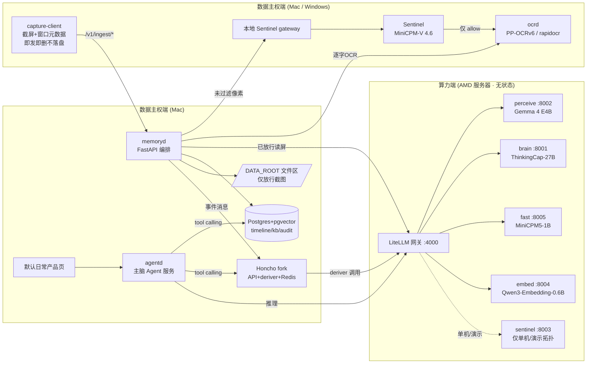

# DejaView 执行手册

这份手册记录 DejaView 的架构、操作约束、测试方法和历史决策。当前任务状态只看根目录的 `TASKBOARD.json`。接手工作时先看第 12 节，再按需要查看第 0 至 4、8、9、10 节。

版本：v1.5，2026-08-05
仓库：[github.com/Aidenwu0209/localwork](https://github.com/Aidenwu0209/localwork)

---

## 0. 公共约定

- **语言**:代码、注释和 commit 使用英文。面向评委的 README 和提交材料使用英文，并保留中文 README 供队员使用。
- **技术栈**:Python 3.12 + uv + ruff + pydantic v2 + FastAPI。所有服务容器化(docker compose)。
- **秘密与隐私**:任何 API key、真实个人数据(姓名/IP/聊天内容)不得写入代码、测试样例、提示词示例。测试用合成数据。
- **不确定就标注**:凡本手册标注 `[VERIFY]` 的事项,执行时先做小实验验证,把结论写进 `docs/verification-log.md` 再继续。
- **完成报告模板**(每个任务结束时提交):
  1. 任务 ID 与一句话结果;2. 运行过的关键命令与输出路径;3. 验收标准逐条核对;4. 偏离手册的决定及原因;5. 新发现的风险。
- **任务状态**:唯一以仓库根 `TASKBOARD.json` 为准(状态机 `false → doing → accept`,另有 `blocked`;领取与断点恢复协议见该文件 instructions);状态变更必须随任务产物同一个 commit 提交,禁止另建进度文件。
- **git 身份与备份**:所有 commit 作者只能是 `Aidenwu0209 <1418557225@qq.com>`,commit message 禁止 Co-authored-by/Generated-with 等任何 AI 署名 trailer;每完成一个任务 push 到 GitHub 备份。
- **禁止事项**:不要追 Honcho 上游 main;不要在服务器上落任何用户数据;不要引入 AGPL 代码(参考 OpenRecall 思路可以,抄代码不行)。

---

## 1. 项目背景

### 1.1 比赛

- **赛事**:AMD AI DevMaster Hackathon(https://luma.com/amd-4dhi),线上提交。
- **赛道**:Track 2 · Agentic AI。
- **基础评分**:功能完整性与应用价值 **60 分**(含场景创新与用户体验);AMD Radeon GPU 与 ROCm 优化 **40 分**(明确包含本地推理执行与推理速度优化)。
- **可选加分**:官方规则另有云模型优化奖励(最高 +20);当前全本地竞赛路径**未申报**,不得把基础 100 分写成已覆盖 120 分。
- **截止**:2026-08-06 23:59(UTC+8)。当前已进入最后提交窗口。
- **合规前置**:所有队员必须注册 AMD AI Developer Program(中国大陆走 AMD Developer Program China),否则获奖不发钱。提交前通读官方 Rules & Conditions。
- 团队最多 3 人。联系方式 ai_dev_contests@amd.com,Discord https://discord.gg/zt9caur5B3。

### 1.2 产品定位

> DejaView 把允许记录的屏幕活动整理成可搜索的时间线。用户可以追问过去做过的工作，并打开对应事件或截图。原始画面先经过设备本地 Sentinel，只有通过策略的内容才会进入 OCR、存储或 AMD 推理。当前版本只支持屏幕帧写入，音频和文档入口返回 `501 unsupported_media`。

### 1.3 比赛说明

Track 2 要求的是可运行的本地 Agent，而不是单独的模型演示。DejaView 选择屏幕记忆作为场景，重点解决两个问题：画面能不能安全入库，以及 Agent 能不能用可检查的证据回答问题。Honcho 提供工作活动的长期摘要；设备本地 Sentinel 在最前面拦截敏感画面；Radeon 负责通过策略后的推理请求。

### 1.4 与现有方案的区别

- 现有工具通常先保存截图，再做 OCR 和搜索。DejaView 把隐私判断放在最前面，阻断的画面不会进入后续阶段。
- Agent 的回答必须带有同一次工具调用返回的事件 ID，不能只凭模型生成一段看似合理的答案。
- 数据库、截图、审计记录和 Honcho 状态留在数据设备，AMD 主机只提供无状态推理。
- 五个模型角色按任务和显存按需启动。P3.1 报告记录的是独立测试，不把它扩大成未经测量的全栈性能结论。

### 1.5 当前发布范围

隐私哨兵 · 带截图证据的问答 · 日报多 Agent 流 · ROCm 优化报告。
音频、文档、MCP、账户同步与安装器不在当前发布范围;不得在评委材料中写成已实现。

---

## 2. 系统架构

### 2.1 组件与数据流


```mermaid
flowchart LR
  subgraph MacWin["数据主权端 (Mac / Windows)"]
    CC[capture-client<br/>截屏+窗口元数据<br/>即发即删不落盘]
    SG[本地 Sentinel gateway]
    S[Sentinel<br/>MiniCPM-V 4.6]
    O[ocrd<br/>PP-OCRv6 / rapidocr]
  end
  subgraph Mac["数据主权端 (Mac)"]
    MD[memoryd<br/>FastAPI 编排]
    TL[(Postgres+pgvector<br/>timeline/kb/audit)]
    HO[Honcho fork<br/>API+deriver+Redis]
    FS[/DATA_ROOT 文件区<br/>仅放行截图/]
    AG[agentd<br/>主脑 Agent 服务]
    UI[默认日常产品页]
  end
  subgraph SRV["算力端 (AMD 服务器 · 无状态)"]
    GW[LiteLLM 网关 :4000]
    B[brain :8001<br/>ThinkingCap-27B]
    P[perceive :8002<br/>Gemma 4 E4B]
    F[fast :8005<br/>MiniCPM5-1B]
    E[embed :8004<br/>Qwen3-Embedding-0.6B]
    SX[sentinel :8003<br/>仅单机/演示拓扑]
  end
  CC -->|/v1/ingest/*| MD
  MD -->|未过滤像素| SG --> S
  MD -->|逐字OCR| O
  S -->|仅 allow| O
  MD -->|已放行读屏| GW --> P
  MD --> TL & FS
  MD -->|事件消息| HO
  HO -->|deriver 调用| GW
  AG -->|tool calling| TL & HO
  AG -->|推理| GW --> B
  GW --> F
  GW --> E
  GW -. 单机/演示 .-> SX
  UI --> AG
```

### 2.2 部署原则

- **有状态的全在数据主权端**:Postgres、Redis、放行截图、时间线、Honcho 和审计日志。单一数据根目录 `DATA_ROOT`(默认 `~/dejaview-data`),可整体打包迁移;当前不写入音频/文档。
- **已交付平台边界**:P3.19 已加入并验收 Windows Win32/mss capture 后端;macOS 仍是比赛实机验证客户端。Windows 完整产品栈、Docker/Honcho/本地 Sentinel 与 SSH tunnel 仍须独立门禁,不得把后端单测写成完整产品栈已验收。
- **服务器纯无状态**:默认只有模型服务 + 网关 + 监控;单机评委拓扑可在 EPYC 运行 ocrd。llama-server 用 `--log-disable`,LiteLLM 关闭请求/支出日志,prompt 不作为用户记忆落服务器磁盘。
- **网络**:LAN 直连或 Tailscale/WireGuard。Honcho 的 Redis 队列天然容错,断网积压重试。
- **两种形态(与双语 README 同名)**:
  - 形态 A「分离 / 日常」:Sentinel、ocrd、memoryd、agentd、数据库与 Honcho 在数据主权设备;仅 Sentinel 放行内容使用 AMD 无状态算力;
  - 形态 B「AMD 单机 / 评委」:同一信任边界内部署全部服务,方便无 Mac 数据面复现。
- SearXNG(用户现有 compose 里有)默认 **disabled**:联网元搜索与"数据不出设备"叙事冲突,演示期间关闭。

### 2.3 逻辑模型名(全系统唯一的模型引用方式)

| 逻辑名 | 角色 | 物理模型 | 端口 |
|---|---|---|---|
| `brain` | 深层:推理/规划/深度视觉/写作 | ThinkingCap-Qwen3.6-27B(Q6_K 产品默认;Q8/Q4 用于消融)+ mmproj-f16 | 8001 |
| `perceive` | 中层:读屏理解、Honcho deriver(基线) | Gemma 4 E4B(Q8 级)+ mmproj-BF16 | 8002 |
| `sentinel` | 快车道·视觉:截图隐私分类 | MiniCPM-V 4.6 Q4_K_M + mmproj-f16 | 8003 |
| `fast` | 快车道·文本:新颖度门/事件合并/打标/主动触发预筛,deriver 候选(T0.9) | MiniCPM5-1B Q8_0 `[VERIFY GGUF repo]` | 8005 |
| `embed` | 全部向量化(查询侧加指令前缀) | Qwen3-Embedding-0.6B Q8_0(官方 GGUF,1024 维,32K 上下文) | 8004 |

**分层推理原则**:每个请求路由到"够用的最便宜层"——高频浅任务走快车道(≈1B),中频理解走 perceive(8B 级),低频深推理走 brain(27B)。这个金字塔本身就是"推理速度优化"评分项的叙事素材。
**应用代码只允许出现逻辑名**。未过滤画面的 `sentinel` 必须经独立且本地的 `SENTINEL_GATEWAY_URL`;其他已放行阶段经 `GATEWAY_URL`,agentd 使用 `RADEON_GATEWAY_URL` 并在真实失败时切 `LOCAL_GATEWAY_URL`。物理路由只存在网关配置。
**确定性层**:ocrd(:8006;Mac 开发默认 rapidocr,产品目标 PP-OCRv6)提供可溯源逐字文本,不是 LLM、不经 LiteLLM,memoryd 经 `OCR_URL` 直连。

**常驻边界**:五个名称是逻辑角色,不是五套权重在所有拓扑同时常驻。分离日常拓扑保留本地 Sentinel,brain 按需起停;单机/演示拓扑根据 `docs/benchmarks.md` 和 `rocm-smi` 余量编排。
**注**:MiniCPM4 论文的内核级加速(InfLLM v2 稀疏注意力、FR-Spec、CPM.cu)绑定 CUDA 框架,llama.cpp ROCm 不继承;我们继承的是能力密度(每参数能力)与 token 效率(MiniCPM-V 4.6 以 1/19 token 成本超过 Qwen3.5-0.8B 的 AAII 分数)。

### 2.4 显存预算(W7900D 48 GB)

P3.1 正式实测表明:brain Q8_0/Q6_K/Q4_K_M 在 MTP-off 时 resident
约 29.36/23.49/18.56 GiB;MTP 在该 build 中额外占用约 4.95 GiB;
perceive Q8_0 resident 约 6.38–6.48 GiB。完整数据见 `docs/benchmarks.md` §2。
产品 brain 默认 Q6_K;共租时先停 perceive、默认关 MTP,只有加载后仍保留
≥6 GiB 余量才可开。每次起服前以 `rocm-smi` 实测为准,不把权重文件大小当成实际峰值。
**embed 选型依据**:Qwen3-Embedding-0.6B vs bge-m3(同为 0.6B 级):MMTEB 64.33 vs 59.56,CMTEB-R 71.02 vs 63.66,上下文 32K vs 8K,维度同 1024(MRL 弹性,升级 4B 可截断回 1024,schema 不变但需全量重嵌)。bge-m3 的稀疏检索优势被 pg_trgm 层覆盖,故弃用。**嵌入模型在 Phase 1 建索引前锁定,之后更换=全量重嵌。**

---

## 3. Provider 抽象与本地/云切换(需求方明确要求)

### 3.1 原则

换供应商 = 只改 `litellm.yaml` 一个块,应用代码与 `.env` 逻辑名零改动。

### 3.2 `deploy/server/litellm.yaml` 模板

```yaml
model_list:
  # ---- 本地(默认,比赛演示必须全本地)----
  - model_name: brain
    litellm_params:
      model: openai/brain
      api_base: http://127.0.0.1:8001/v1
      api_key: "none"
  - model_name: perceive
    litellm_params:
      model: openai/perceive
      api_base: http://127.0.0.1:8002/v1
      api_key: "none"
  - model_name: sentinel
    litellm_params:
      model: openai/sentinel
      api_base: http://127.0.0.1:8003/v1
      api_key: "none"
  - model_name: fast
    litellm_params:
      model: openai/fast
      api_base: http://127.0.0.1:8005/v1
      api_key: "none"
  - model_name: embed
    litellm_params:
      model: openai/embed
      api_base: http://127.0.0.1:8004/v1
      api_key: "none"

  # ---- 云端替身(开发期解锁,取消注释即切换)----
  # - model_name: brain
  #   litellm_params:
  #     model: openrouter/qwen/qwen3.6-27b   # 或 dashscope/openai 任一
  #     api_key: os.environ/OPENROUTER_API_KEY
```

### 3.3 切云三纪律(写进 README)

1. **sentinel 永远本地**——它看的是未过滤的敏感画面,上云等于叙事自杀;
2. **embed 切换必须全量重建索引**——不同嵌入模型的向量空间不互通;
3. **比赛演示与提交视频必须全本地**——云端替身只用于开发期解耦调试。

---

## 4. 仓库与工程约定

### 4.1 命名

- 主仓库:**用户指定使用现成私有仓库 `Aidenwu0209/localwork`**(2026-07-20 定,新建 dejaview 仓库的原计划作废);项目代号/产品名仍为 **DejaView**,对外材料用产品名。**不要用** `engram` / `localmind` / `recall` 作产品名(全部撞车或商标风险)。
- Honcho fork:`honcho-dejaview`(独立 fork 仓库,主仓库以 submodule 引用)。
- GitHub topics:`rocm` `radeon` `llamacpp` `agentic-ai` `local-first` `privacy` `amd-hackathon`。

### 4.2 目录树

```
localwork/                 # 远程 github.com/Aidenwu0209/localwork(项目代号 DejaView)
├── README.md              # 英文主文档:双拓扑图、评分对照、快速开始
├── README.zh.md
├── docs/
│   ├── EXECUTION_HANDBOOK.md   # 本文件的仓库副本
│   ├── verification-log.md     # 所有 [VERIFY] 结论
│   ├── benchmarks.md           # ROCm 优化报告(评分 40 分的主要证据)
│   └── licenses.md
├── deploy/
│   ├── server/            # GPU 端:compose.gpu.yml, litellm.yaml,
│   │                      # llama-launch/*.sh, download-models.sh, bench/
│   └── mac/               # 数据端:compose.data.yml, timeline-init.sql
├── services/
│   ├── memoryd/           # 摄取编排(哨兵→OCR→新颖度门→理解→入库→Honcho)
│   ├── ocrd/              # PP-OCRv6 逐字层微服务(部署在算力端 CPU)
│   └── agentd/            # 主脑 Agent(tool calling, 日报, OpenAI 兼容出口)
├── clients/capture/       # macOS + Windows 屏幕采集后端;产品门禁分开验证
├── third_party/honcho     # submodule → honcho-dejaview @ 钉死 commit
└── Makefile               # make server-up / data-up / bench / demo-seed
```

### 4.3 本机已有资产

- Honcho 补丁包已解压:`/Users/wu/Projects/Aidenwu0209/honcho-patches/honcho-local-patches/`
  - `git-diffs/all-local-patches.diff`(基于上游 `340175ad`,见 `REPO_STATE.txt`)
  - 修改点:openai backend 的 json_mode 优先、deriver 裸 JSON 兼容、deriver 提示词重写、Dockerfile typing-extensions 修正、prometheus 扩展、docker-compose(含需修正的 cadvisor `platform: linux/arm64`)。
- 用户 Mac 上有一套**可运行**的 Honcho 实例,其 `.env` 可作为配置参考(执行 agent 向用户索取)。

---

## 5. 感知客户端规格(clients/capture)

### 5.1 当前交付边界(macOS + Windows screen-only)

| 能力 | 已交付 macOS 客户端 | Windows 状态 |
|---|---|---|
| 截屏 | `mss`(Quartz 后端),内存中编码后立即 POST | Win32 可见窗口区域 + `mss`,内存中编码后立即 POST |
| 前台应用/窗口标题 | pyobjc:`NSWorkspace` + `CGWindowListCopyWindowInfo` | user32 `EnumWindows` + 进程名/标题 |
| 浏览器 URL(尽力而为) | osascript 问 Safari/Chrome | 不探测,字段为 `null` |
| 音频/文档 | 未交付;memoryd 明确返回 `501 unsupported_media` | 未交付 |
| 权限 | 需一次性授予「屏幕录制」 | 交互解锁桌面;安全桌面不可用时 fail-closed |

服务器端(Ubuntu)**不需要**任何截屏能力。Windows 运行入口见
`deploy/windows/README.md`;Windows capture 后端已随 P3.19 accept 入仓,完整
Windows 产品栈(Docker/Honcho/本地 Sentinel/SSH tunnel)仍须独立门禁,不得把
后端单测写成已验证产品栈。

### 5.2 行为规范

- **事件触发**:前台窗口/标题变化即截屏;另有 30s 周期兜底帧。最小间隔 3s。
- **去重**:dhash(`imagehash` 库)与上一帧距离 < 10 则丢弃。
- **画幅**:上报按原生分辨率等比缩至宽 ≤2560px(保 Retina 细节供 OCR 识别小字);服务器 OCR 完成后归档再缩至 ≤1600px WebP quality 80。
- **隐私**:内存里处理,POST 完即丢,客户端磁盘零残留;锁屏/屏保时暂停采集。
- **配置**:`capture.yaml`(memoryd_url, device_id, 触发参数、URL 探测开关)。
- 运行:`CAPTURE_DEVICE_ID=<id> make capture`;保持前台与权限状态可见。

### 5.3 上报契约(memoryd 提供)

```
POST /v1/ingest/frame   multipart/form-data:
  file: webp 图像
  meta: {"device_id","ts","app","window_title","url|null","trigger":"change|periodic"}
```

`POST /v1/ingest/audio` 与 `POST /v1/ingest/doc` 是历史规划接口,当前固定返回
`501 unsupported_media`;不得作为已实现能力进入提交材料。

---

## 6. 服务端各组件规格

### 6.1 推理层(deploy/server)

**构建**:优先用 lemonade-sdk/llamacpp-rocm 预编译产物(主办方生态,写进 README 加分);fallback 自编译:
```bash
cmake -B build -DGGML_HIP=ON -DAMDGPU_TARGETS=gfx1100 -DCMAKE_BUILD_TYPE=Release && cmake --build build -j64
```
`[VERIFY]` 当前 llama.cpp 版本的 HIP 旗标名。

**模型权重**(`download-models.sh`,均从 HF 下载并记录 sha256)。服务器存放:模型在 overlay `/root/dejaview-models/`(容器重建即失,靠脚本一键重建),引导脚本与 sha256 清单持久化于 `/workspace/dejaview-models/`(唯一持久卷,仅 10GB)并入 GitHub。**状态:2026-07-20 已全部就位(10 个 gguf,41 GB)。** 下载方法注意:HF 直连不通走 hf-mirror;hf CLI 对新仓库(Xet 存储)经镜像会 401,引导脚本已固化为 wget 直连 resolve URL 的方式:

| 逻辑名 | HF repo | 文件 |
|---|---|---|
| brain | `bottlecapai/ThinkingCap-Qwen3.6-27B-GGUF` | `ThinkingCap-Qwen3.6-27B-Q8_0.gguf`(27.1 GB)+ `mmproj-ThinkingCap-Qwen3.6-27B-f16.gguf`(0.9 GB);应急 Q6_K 20.9 GB |
| perceive | `ggml-org/gemma-4-E4B-it-GGUF`(或 batiai/unsloth 镜像) | 主模型 Q8 级 + `mmproj-BF16.gguf`(**mmproj 只能用 BF16**,量化投影器有已知崩溃/质量问题) |
| sentinel | `openbmb/MiniCPM-V-4.6-gguf` | `Q4_K_M`(~0.5 GB)+ `mmproj-…-f16`(~1.1 GB) |
| fast | `openbmb/MiniCPM5-1B-GGUF`(已验证,HF/ModelScope 双发) | `MiniCPM5-1B-Q8_0.gguf`(1.1 GB;应急 Q4_K_M 657 MB);llama-server 加 `--jinja` |
| embed | `Qwen/Qwen3-Embedding-0.6B-GGUF`(官方) | Q8_0(~0.7 GB),输出 1024 维 |
| rerank(可选) | Qwen3-Reranker-0.6B 的 GGUF `[VERIFY 官方是否出 GGUF 及 llama.cpp /v1/rerank 支持]` | Q8 级(~0.7 GB) |

**启动模板**(每模型一个脚本,systemd 或 compose 均可):
```bash
llama-server -m brain-Q8_0.gguf --mmproj brain-mmproj-f16.gguf \
  --alias brain -ngl 99 -c 32768 -np 2 --host 127.0.0.1 --port 8001 \
  --spec-type draft-mtp    # [VERIFY] MTP 旗标在当前版本的确切写法与收益
llama-server -m e4b-Q8.gguf --mmproj e4b-mmproj-BF16.gguf \
  --alias perceive -ngl 99 -c 16384 -np 4 --port 8002
llama-server -m minicpm46-Q4_K_M.gguf --mmproj minicpm46-mmproj-f16.gguf \
  --alias sentinel -ngl 99 -c 4096 -np 4 --port 8003
llama-server -m minicpm5-1b-Q8_0.gguf \
  --alias fast -ngl 99 -c 8192 -np 8 --port 8005   # no-think 模式为主,思考开关按任务
llama-server -m qwen3-embedding-0.6b-Q8_0.gguf \
  --embedding --pooling last -ub 8192 --port 8004   # 旗标来自 Qwen 官方模型卡
# 可选(Phase 2 按需):llama-server -m qwen3-reranker-0.6b.gguf --rerank --port 8007  # [VERIFY]
```
统一追加隐私旗标(不落 prompt 日志)`[VERIFY 旗标名]`。

**网关**:LiteLLM(:4000),配置见第 3 节。`[VERIFY]` LiteLLM 对 openai-compatible 后端的 image/audio content part 透传。

**监控**:node-exporter + rocm-smi exporter(候选 `rocm_smi_exporter`,不可用则写 30 行 textfile collector 脚本)+ Prometheus + Grafana。大屏面板:每实例 tokens/s、VRAM、GPU util、流水线事件率。

**OCR 微服务 `ocrd`(:8006,CPU,无状态)**:PaddleOCR **≥3.7.0,PP-OCRv6 流水线**,容器化跑双路 EPYC(不占 GPU;不要折腾 PaddlePaddle 的 ROCm 后端)。
- **模型档位**:默认 `PP-OCRv6_medium` det+rec(34.5M,精度超 v5_server +4.6%/+5.1%,官方称 OCR 准确率超过 Qwen3-VL-235B/GPT-5.5——写进答辩材料佐证双层设计);T0.5 压测若 medium P95 超标,降 `PP-OCRv6_small`(7.7M,精度仍高于旧 mobile 档)。50 语言单模型,中英混排免切换。
- **前处理全关**:文档方向分类、去畸变、文本行方向三个开关关闭(截图永远正且平),纯赚速度。
- **推理后端**:EPYC 上 A/B paddle 原生(oneDNN)vs ONNX Runtime,OpenVINO 作第三备选;多进程 worker(初始 8×,T0.5/T1.8 定稿)。
- **明确不用**:PaddleOCR-VL(0.9B VLM)——不是嫌它大(与快车道同量级),而是任务形状:用生成做整屏转写,输出 token 数 ∝ 屏幕文字量(密集帧 3000+ token 串行解码,是哨兵单次调用的 60 倍解码量),同时把幻觉面引入确定性层;det+rec 为并行判别式,成本与文字量近乎无关。系统纪律:同量级小模型只允许干"短输出的判断"(哨兵/新颖度门),不允许干"长输出的转写"。PP-StructureV3 同样不用(版面/表格解析,截图场景过重,文档已归 MarkItDown)。
- 接口:`POST /ocr`(image)→ `{"full_text":"…","blocks":[{"text":"…","bbox":[x1,y1,x2,y2],"conf":0.98}]}`
- `[VERIFY]` PaddleOCR 3.7 的 Python API 参数名与 PP-OCRv6 模型拉取方式;中英混排截图为主要验收场景。与其他服务同样关闭内容日志,图像处理完即弃。

### 6.2 memoryd(Mac,摄取编排)

处理流水线(每帧):
1. 收到 frame → 调 `sentinel`(优先 16x 视觉压缩快档 `[VERIFY llama.cpp 是否暴露压缩率开关]`):
   - 提示词输出严格 JSON:`{"decision":"allow|block","category":"password_prompt|banking_finance|private_chat|id_document|adult|normal","confidence":0-1}`
   - block → 丢弃图像,写 `sentinel_audit`(只记分类,不记画面);allow → 继续。**被拦截的帧永远不进 OCR**。
2. 调 `ocrd` 逐字层:得到 `full_text` + `blocks`(带 bbox)。确定性、零幻觉,EPYC 上毫秒级。
3. 新颖度门(两级,先免费后便宜):
   a. 代码级:OCR token 集与同窗口上一事件做 Jaccard 相似度,>0.9 → 直接并入上一事件(更新 `end_ts`),**零 LLM 调用**;<0.5 → 判新,直进第 4 步;
   b. 边界带(0.5–0.9)调 `fast`(no-think):输入元数据 + OCR 文本 diff,输出 `{"novelty":0-1,"delta":"一句话变化"}`,novelty<0.35 并入上一事件。
4. 调 `perceive`(图 + OCR 全文 + 窗口元数据),输出严格 JSON:
```json
{"activity":"一句话:用户在做什么","app_context":"ide|browser|terminal|chat|docs|other",
 "topics":["…"],
 "verbatim":{"errors":[],"urls":[],"identifiers":[],"numbers":[],"quotes":[]}}
```
   提示词纪律:**verbatim 字段只准从 OCR 文本中摘取,禁止自行转写图面文字**(防幻觉硬规则);图像仅供布局/视觉上下文;窗口元数据由系统注入,模型不得改写 app/title 字段。
5. 组装事件 → `embed` 向量化 → 写 `timeline_events`(含 ocr_text/ocr_blocks)+ 截图存 `DATA_ROOT/screenshots/YYYY/MM/DD/`。
6. 节流写 Honcho:每 5 分钟或 20 事件,由 `fast` 把 activity 行合并成一条陈述式 message 发给 Honcho(workspace=`dejaview`, peer=`owner`, session=按天)。
7. 音频与文档摄取属于历史规划,当前未交付;入口 fail-closed 返回 501,
   不进入 timeline、Honcho 或知识库。

### 6.3 时间线库 DDL(deploy/mac/timeline-init.sql)

```sql
create extension if not exists vector;
create extension if not exists pg_trgm;
create table timeline_events(
  id bigserial primary key, ts timestamptz not null, device_id text not null,
  kind text not null check (kind in ('frame','audio','doc')),
  app text, window_title text, url text,
  activity text, topics text[], verbatim jsonb,
  ocr_text text, ocr_blocks jsonb,
  screenshot_path text, transcript text,
  embedding vector(1024));  -- Qwen3-Embedding-0.6B;升级 4B 用 MRL 截断回 1024,schema 不变(需全量重嵌)
create index on timeline_events using hnsw (embedding vector_cosine_ops);
create index on timeline_events (ts);
create index on timeline_events using gin (ocr_text gin_trgm_ops);  -- 精确子串:报错码/PR号/URL
create table sentinel_audit(id bigserial primary key, ts timestamptz not null,
  device_id text, category text not null, decision text not null, confidence real);
create table kb_chunks(id bigserial primary key, doc_id text, source_path text,
  chunk text, embedding vector(1024));
```

### 6.4 Honcho 集成(third_party/honcho)

1. fork `plastic-labs/honcho` → `honcho-dejaview`,checkout `340175ad`,apply `all-local-patches.diff`。
2. 修正:cadvisor 去掉 `platform: linux/arm64`(或整个删掉,监控在服务器侧);TZ 改 `Asia/Shanghai`;**deriver 提示词 few-shot 例子全部换成合成人物**(现版本含真实个人信息:城市、ECU 项目、内网 IP)。
3. `.env`:LLM provider=openai-compatible,base_url=`${GATEWAY_URL}`,deriver 模型=`perceive`,dialectic 模型=`brain`,embedding=`embed`(参考用户现有可运行实例的 .env)。T0.9 A/B 达标后 deriver 切 `fast`(一行配置)。
4. 验收基线:POST 一批合成消息 → deriver 产出原子事实 → `peer/chat`(dialectic)能答"这个人最近在做什么"。

### 6.5 agentd(Mac,主脑服务)

- 对外暴露 **OpenAI-compatible** `/v1/chat/completions`(model=`dejaview`),同时在 `/` 提供默认日常产品页。
- Tools(function calling,经 `brain`):
  - `search_timeline(query, mode=hybrid|semantic|exact, time_from?, time_to?, k)` → 向量 + pg_trgm 精确子串 + 时间过滤;报错码/PR 号/URL 类查询走 exact 直接命中。语义路查询侧统一加指令前缀(`Instruct: 检索用户活动时间线\nQuery: …`,Qwen3-Embedding 的 instruction-aware 用法);命中不足时可启用 `rerank` 对 top-50 重排(可选)
  - `query_user_model(question)` → Honcho dialectic
  - `search_kb(query, k)`(仅检索已有合成/历史块;当前文档写入入口为 501)
  - `fetch_screenshot(event_id, highlight_text?)` → 只返回受控证据可用性/高亮元数据;不把本机原始路径暴露给模型或浏览器
  - `generate_daily_report(date)`
- **回答格式纪律**:凡引用记忆必须带 `[event#id HH:MM app]` 行内引用,UI 侧渲染成可点开截图。
- 日报多 Agent 流:Planner(brain)拟提纲 → Retriever(代码检索+perceive 压缩)取证据 → Writer(brain)成文 → Reviewer(brain, temperature 0.2)逐条核对引用真实性。过程日志在 UI 可见(体现 multi-agent,评委要看到)。
- 主动建议守护(可砍):每 60s 看最近 10 分钟事件,同一报错持续 >3 分钟 → 系统通知给出解法卡片。

### 6.6 UI

- 默认产品页由 agentd 自带:时间线筛选、开放式问答、结构化引用、短时签名证据、隐私摘要、Honcho 画像和诚实状态。六幕 demo stage 保持隔离,不是日常产品入口。
- Grafana 大屏独立浏览器窗口,演示时并排。

---

## 7. 任务分解(WBS)

> 标注:【并行】可与同段其他任务同时做;预估为单 agent 专注工时。

### 执行序调整:开发在 Mac 先行,服务器工作集中到两个窗口(M → S1 → S2)

背景:用户的 Mac 是纯客户端/开发机;AMD 服务器是独立完整主机,常有其他任务在跑。因此不按日历顺序跑 Phase 0→1→2,改为三段。技术前提:执行 agent 在 Mac 上可同时本地开发并经 `ssh` 驱动服务器(长任务挂 nohup,断连不中断);但**除 S1/S2 窗口外不得主动连接或占用服务器**。

**M · Mac 开发期(立即开始,完全不碰服务器)**
- 全部 Phase 1 开发前移:T1.1 骨架、T1.2 Honcho(推理指向替身)、T1.3 时间线库+memoryd、T1.4 采集客户端、T1.8 ocrd(精度 A/B 在 Mac CPU 跑,ARM 用 onnxruntime 后端;延迟数字标注"待 EPYC 复测")
- Phase 2 开发可同步推进:T2.2 agentd 工具层、T2.3 文档投喂、T2.4 日报流程(对替身联调逻辑与提示词)
- 测试资产:T0.5 截图集 20 张、T0.9 合成消息 30 条+相邻帧 50 对、哨兵敏感页测试集(全部合成)
- **开发推理栈(实测定稿:Mac=Apple M5/16GB,无云 API key,全本地 Metal)**:sentinel/fast/embed(≈3.5 GB)跑真模型;perceive 用 E4B Q4_K_M+mmproj(≈5.5 GB);brain 开发期由同一 E4B 实例兼任,质量待 S2 换 27B 复验;按任务起停实例,禁止全员常驻;开发全程零外部调用,真实屏幕测试可直接跑全链路

**S1 · 第一个服务器短窗口(≈半天,尽早争取,与其他任务错峰)**
- 顺序:T0.1 只读基线 → T0.3 权重下载(≈45 GB,nohup)→ T0.2 引擎就绪 → T0.4 五实例+网关冒烟
- 目的:把 ROCm 生死题(能编译、能加载、放得下、E4B 音频通不通的初判)提前钉死;发现硬伤时还有时间改方案。**强烈建议不要拖到最后一周。**

**S2 · 最终服务器窗口(1–2 天,其他任务结束后)**
- T0.5–T0.9 的 GPU 侧验证、T0.7/T0.8 基准、T3.1 消融报告
- Mac 侧 .env 从替身切换到服务器网关(改一个变量),端到端联调,录制 demo

纪律:替身仅限合成数据,真实个人数据一律等全本地链路后再接入。

### Phase 0 · 环境与风险验证(7/20–7/22)

| ID | 任务 | 关键步骤 | 验收标准 | 依赖 |
|---|---|---|---|---|
| T0.1 | 服务器基线 | rocminfo/rocm-smi/磁盘/docker 检查,记录 `docs/env-baseline.md` | gfx1100 可见,ROCm 7.2 确认 | 用户给 SSH |
| T0.2 | 推理引擎就绪 | lemonade llamacpp-rocm 预编译优先,fallback 自编译 | 任一小模型能出 token | T0.1 |
| T0.3 | 权重下载 | `download-models.sh` 五组 + sha256 | 文件齐全校验过 | T0.1【并行】 |
| T0.4 | 五实例+网关起服 | 启动脚本、litellm.yaml、健康检查 | 经 :4000 用 5 个逻辑名各完成一次推理 | T0.2,T0.3 |
| T0.5 | 风险A:感知层保真 | 20 张真实风格截图(代码/终端报错/中英网页/聊天):PP-OCRv6 medium vs small 准确率/延迟 A/B(含 paddle vs ONNX Runtime 后端对比)+ E4B(给定 OCR 文本)语义质量 | OCR 档位与后端定稿 + 弱项场景清单(小字/特殊 UI);E4B 理解质量结论 | T0.4 |
| T0.6 | 风险B:E4B 音频 | 16k mono wav 经 API 转写 | 可用性结论;不可用→改 whisper.cpp,更新 6.2 | T0.4 |
| T0.7 | 风险C:MTP 收益 | brain 开/关 `draft-mtp` 各跑标准 prompt 集 | tok/s 对比表进 `docs/benchmarks.md` | T0.4 |
| T0.8 | 风险D:混合负载 | asyncio 并发(读屏×4+转写×1+deriver×2+哨兵×4+快车道×8) | P50/P95 延迟表;slot 参数定稿 | T0.5–0.7 |
| T0.9 | 快车道质量 A/B | Honcho deriver 提示词跑 30 条合成消息:`fast` vs `perceive`;另测 50 对相邻帧新颖度判定;`brain` 盲评 | 结论进 verification-log;敲定 deriver 归属与 novelty 阈值 | T0.4 |

### Phase 1 · 记忆层(7/23–7/27)

| ID | 任务 | 验收标准 | 依赖 |
|---|---|---|---|
| T1.1 | 仓库脚手架(目录树/compose×2/.env.example/Makefile) | `make server-up` `make data-up` 全绿 | T0.4 |
| T1.2 | Honcho fork+补丁+清洗+部署 Mac(见 6.4) | 合成消息→事实→dialectic 全链路 | T1.1 |
| T1.3 | timeline 库+memoryd 骨架(/ingest/frame 假数据路径) | curl 假事件→pgvector 可检索 | T1.1【并行 T1.2】 |
| T1.4 | capture-client macOS MVP(5.1/5.2 全规格) | 真实使用 30 分钟,事件正确入库,客户端零落盘 | T1.3 |
| T1.5 | capture-client Windows 适配 | Win 机 15 分钟采集入库 | T1.4【并行】 |
| T1.6 | perceive 提示词 v1 迭代 | 抽查 20 事件:verbatim 全部可溯源到 OCR 文本(零编造),activity 质量达标 | T1.4 |
| T1.7 | 音频链路(按 T0.6 结论) | 10 分钟录音→转写→事件端到端 | T1.3 |
| T1.8 | ocrd 微服务(PP-OCRv6 CPU 容器,档位按 T0.5 定稿)+ memoryd 接线 + pg_trgm 检索 | 单帧 P95 <1s、并行吞吐达标(EPYC);报错码/URL 精确检索命中 | T1.3【并行】 |
| **M1** | **里程碑:系统自动长记忆** | 一天正常使用后 timeline>500 事件,Honcho 画像非空 | 全部 |

### Phase 2 · Agent 能力(7/28–8/1)

| ID | 任务 | 验收标准 | 依赖 |
|---|---|---|---|
| T2.1 | 哨兵接入 memoryd(6.2 流程1) | 敏感测试集(银行页/密码框/聊天)拦截率与正常页误杀率报告 | M1 |
| T2.2 | agentd + 4 个 tool + 引用格式 | 3 类问题端到端:时间线事实/用户偏好/知识库,均带证据;检索命中不足时启用可选 rerank 并复测 | M1 |
| T2.3 | 文档投喂管道(MarkItDown) | PDF+Word+一个代码 repo 投喂后可问答 | T2.2 |
| T2.4 | 日报多 Agent 流+过程可视化 | 一天真实数据生成日报,引用可点开截图 | T2.2 |
| T2.5 | 主动建议守护(可砍) | 演示场景可复现触发 | T2.2 |
| T2.6 | UI 接线(Open WebUI+时间线页) | 六幕 demo 全部走通 | T2.1–2.4 |
| **M2** | **里程碑:demo 六幕可完整跑** | 按第 9 节脚本彩排一遍并录屏 | 全部 |

### Phase 3 · 优化与材料(8/2–8/5)

> 注:下表为原始 WBS 规划编号(T3.x),只作历史。**实际执行状态唯一以 `TASKBOARD.json` 为准**;当前产品化队列已扩展至 P3.12–P3.18。

| ID | 任务 | 验收标准 |
|---|---|---|
| T3.1 | ROCm 消融报告:量化(Q8/Q6/Q4)×MTP(on/off)×并发(1/4/8),表+图 | `docs/benchmarks.md` 成稿,含 rocm-smi 截图 |
| T3.2 | Grafana 大屏定稿 | 四实例指标+事件率一屏可见 |
| T3.3 | MCP server 包装记忆查询(可砍) | Cursor 内可查询自己的时间线 |
| T3.4 | README(双语)+双拓扑图+licenses.md+一键部署 | 干净机器按 README 可复现形态 A |
| T3.5 | 演示视频(≤5 分钟,按第 9 节分镜,含远端计算链路故障切换) | 成片 |
| T3.6 | Rules 核对+提交打包 | 提交清单(第 10 节)全勾 |

### Phase 4 · 提交(8/6)

T4.1:8/5 完成上传,8/6 只留缓冲。

---

## 8. ROCm 优化报告规格(评分 40 分的主武器)

`docs/benchmarks.md` 的原始目标清单为:
1. 硬件/软件环境表(W7900D、ROCm 7.2、llama.cpp commit、驱动 6.14.14);
2. 逻辑角色的 VRAM 分配与实际常驻策略(rocm-smi 截图 + 表),不强说所有权重同时常驻;
3. brain:prefill/decode tok/s,MTP on/off,Q8 vs Q6 vs Q4(速度+抽样质量对比);
4. perceive:单帧读屏延迟分布,`-np` 1/2/4 吞吐曲线;
5. 快车道:sentinel 单帧分类延迟(4x vs 16x 压缩档 `[VERIFY]`)、fast 吞吐;分层路由收益(同日负载若全走 brain 的 token 成本对比)、新颖度门节流比例(其中零 LLM 的 Jaccard 级占比);ocrd 在 EPYC 上的单帧延迟与并行吞吐;
6. 端到端:一帧从上报到入库的分段耗时(哨兵/新颖度门/理解/嵌入);
7. 每张表注明测法与次数(≥3 次取中位)。
表格模板:`| 模型 | 量化 | 场景 | 并发 | prefill t/s | decode t/s | P95 ms | VRAM GB |`

**已完成与边界**:P3.1 已完成 checksummed 的 brain 18-cell
quant×MTP×concurrency 矩阵和 perceive 3-cell `-np` 矩阵,每 cell 1 warm-up
+ 3 次实测;历史小模型 pass 也保留了 fast/sentinel/embed 参考。
sentinel 4×/16×压缩、novelty-gate 节流收益、EPYC ocrd 并发和完整跨机分段时延
仍在报告中明确标为 P3.1 范围外;不得对评委声称已覆盖全部原始目标。

---

## 9. 演示视频分镜(六幕)

1. 大屏:五个逻辑角色、当前实际常驻状态与 GPU 指标(Grafana+rocm-smi),旁白讲存储/计算分离拓扑与三层推理金字塔;
2. 正常工作几分钟,时间线自动长出带理解的事件流;
3. 打开银行登录页——哨兵当场拦截,审计日志出现"已拒绝记录",画面本身没入库;
4. 问"上周三下午看的那个 ROCm PR 是哪个?"——回答附当时截图证据,命中文字用 bbox 高亮框出;
5. 问"根据你对我的了解,我会更喜欢哪种方案?"——Honcho 画像作答;
6. "生成今天的日报"——多 Agent 流水线过程可见;页面可见地**断开已验证的 Radeon SSH 计算链路**,再运行一遍,由独立验明的 Local Metal fallback 完成。Wi-Fi 不动,不伪造物理拔线。

---

## 10. 提交清单

> **2026-08-03 发布旁注:** 诚实状态见 [`docs/licenses.md`](licenses.md)「Handbook §10 readiness」。**未完成项勿勾。** 队员须自行确认 AMD / Rules(agent 无法代注册)。

- [ ] 全员注册 AMD AI Developer Program(大陆:AMD Developer Program China) — **待·队员自检**(见 licenses.md AMD checklist)
- [ ] Rules & Conditions 通读,按要求的格式/平台提交 — **待·队员自检**
- [x] 英文 **Project Specification Document** — Markdown + 可编辑 DOCX 位于 `docs/submission/`;8 页渲染与可访问性 QA 已通过。
- [x] 源码 + 英文 README + 可复现 quickstart — 干净检出已完成两次幂等 setup、doctor 与完整第一方测试;本地不推断 GitHub 可见性,提交前人工确认官方要求的公开状态。
- [x] 可编辑 PPT / Poster 补充材料 — 7 页 PPT 已逐页渲染、无溢出,每页备注含来源。
- [x] `docs/benchmarks.md` + Grafana 截图 — **已具备**(OCR A/B +
  P3.1 ROCm 正式消融 + P3.2 一屏截图)
- [x] 已验收演示视频(≤5 分钟) — **P3.4 已完成**:2:37 六幕原始证据片保持不变,含远端链路故障切换与 Local Metal 第二次日报;P3.18 另导出完整英文烧录字幕提交版和可编辑 SRT。官方推荐 3–5 分钟,2:37 时长差异保持显式披露。
- [x] `docs/licenses.md`:Apache-2.0(ThinkingCap/MiniCPM/Honcho/Qwen3-Embedding;手册旧称 bge-m3 已替换)+ MIT(llama.cpp 等)+ **Gemma 单独标注** + 各 Python 依赖 — **已具备**(P3.5)
- [x] 全部提示词/示例已去个人信息;仓库无任何真实隐私数据、无 API key — **基本具备**(演示前若真实采集须清库)
- [ ] 比赛服务器上只有演示数据,赛后可一键销毁重建 — **部分具备**(无状态算力+模型引导脚本;提交前再确认演示数据)
- [x] 根目录项目 `LICENSE` / `NOTICE` 与第三方清单 — P3.17 发布套件验收通过。
- [ ] 可选云模型优化 +20 — **未申报**;当前材料仅对齐 60+40 基础分。

---

## 11. 风险与兜底总表

| 风险 | 探测信号 | 兜底 |
|---|---|---|
| OCR 对小字/特殊 UI 识别差 | T0.5 弱项清单 | 提高上报分辨率(≤2560px 已预留);弱项场景由 E4B 图像通道补充逐字 |
| 评委误以为支持音频/文档 | README/规格出现旧规划 | 明确当前 screen-only;audio/doc 返回 501 |
| MTP 在 gfx1100 无收益 | T0.7 加速 <1.1× | 关 MTP,保留"少思考 token"卖点 |
| perceive 吞吐不足 | T0.8 P95>5s | 加大截屏间隔;调低新颖度门阈值多合并;或第二实例+brain 退 Q6_K |
| 快车道(≈1B)质量不足 | T0.9 盲评低于 perceive 的 95% | deriver 留在 perceive;fast 只做新颖度门/打标/合并 |
| 服务器被回收/故障 | — | 形态 A 的数据本在用户设备;AMD 无状态栈可重建,agentd 可显式降级到 Local Metal |
| 时间不够 | 8/1 未到 M2 | 按 1.5 节砍需求顺序执行 |

---

## 附录 A · 关键链接

- 比赛:https://luma.com/amd-4dhi
- Honcho:https://github.com/plastic-labs/honcho(钉 `340175ad`)
- ThinkingCap:https://huggingface.co/bottlecapai/ThinkingCap-Qwen3.6-27B-GGUF
- Gemma 4 E4B GGUF:https://huggingface.co/ggml-org/gemma-4-E4B-it-GGUF
- MiniCPM-V 4.6 GGUF:https://huggingface.co/openbmb/MiniCPM-V-4.6-gguf(Thinking 变体同仓库系列)
- MiniCPM 文本系(含 MiniCPM5):https://github.com/OpenBMB/MiniCPM · MiniCPM5-1B:https://huggingface.co/openbmb/MiniCPM5-1B
- 论文:MiniCPM 能力密度(arXiv 2404.06395)· MiniCPM4 端侧效率(arXiv 2506.07900)· LLaVA-UHD v4 视觉压缩(arXiv 2605.08985)
- llama.cpp:https://github.com/ggml-org/llama.cpp · llamacpp-rocm:https://github.com/lemonade-sdk/llamacpp-rocm
- Lemonade:https://github.com/lemonade-sdk/lemonade · LiteLLM:https://github.com/BerriAI/litellm
- MarkItDown:https://github.com/microsoft/markitdown · Open WebUI:https://github.com/open-webui/open-webui
- PaddleOCR(PP-OCRv6,需 ≥v3.7.0,2026-06-11 发布):https://github.com/PaddlePaddle/PaddleOCR(Apache-2.0);模型集合在 HF/ModelScope 的 PP-OCRv6 collection
- Qwen3-Embedding-0.6B(官方 GGUF,Apache-2.0):https://huggingface.co/Qwen/Qwen3-Embedding-0.6B-GGUF · 配套 Qwen3-Reranker 系列见 Qwen 官方博客
- 先例参考(只读思路,勿抄代码,AGPL):OpenRecall

---

## 12. 工作交接(2026-08-03 · 给后续执行 Agent)

> **先读本节,再读其他章节。** 本节保留 2026-07-20～07-28 的历史决策,
> 并补入 8/2–8/3 成熟产品加固。状态仍只以 `TASKBOARD.json` 为准;历史端口、
> 旧 WBS 和旧未完成文案不能覆盖当前状态。
> 配套:`STATUS.md`(人话起服)· `TASKBOARD.json`(状态机)· `docs/verification-log.md`(踩坑)· `deploy/server/DEPLOY.md`(服务器)· `docs/AGENT_KICKOFF_PROMPT.md`(开工指令)· `docs/benchmarks.md`(OCR+ROCm 数据)。

### 12.0 接手三步(不可跳过)

1. 通读本节 §12 全文 + `STATUS.md`。
2. 打开 `TASKBOARD.json`,只做 `false` / `blocked` / 合法恢复的 `doing`
   任务。当前 P3.1–P3.19 均已 `accept`,勿重做;仅协助人工提交门槛。
3. 把 `docs/AGENT_KICKOFF_PROMPT.md` 整段丢给执行 agent 作为系统指令。

| 顺序 | 文件 | 用途 |
|---|---|---|
| 1 | **本节 §12** | 进度、决策、缺口、纪律 |
| 2 | `STATUS.md` | 一键起服 + 已知问题(叙述版) |
| 3 | `TASKBOARD.json` | 领取任务前的状态机 |
| 4 | `docs/verification-log.md` | 已解 `[VERIFY]` 与踩坑 |
| 5 | `docs/benchmarks.md` | OCR A/B(§1)+ 已完成 ROCm 消融(§2) |
| 6 | `deploy/server/DEPLOY.md` | 服务器起停 / VRAM / Dolphin |
| 7 | `docs/benchmark-evidence/p31/p31-w7900d-20260728T075653Z/` | P3.1 原始 JSON、日志、rocm-smi、hash、派生 summary |
| 8 | 本手册 §0–§11 | 当前规格 + 显式标注的历史 WBS |
| 9 | `docs/AGENT_KICKOFF_PROMPT.md` | 可直接粘贴的开工指令 |

### 12.1 一句话现状(2026-08-06)

**产品代号 DejaView**(déjà vu + view / 全本地数字记忆体)。赛道:AMD AI DevMaster Hackathon Track 2 · Agentic AI。基础评分 60(功能)+40(ROCm),可选云模型奖励 +20 **未申报**。截止 **2026-08-06 23:59 UTC+8**。

**全链路已跑通并验收**(Mac 采集 → memoryd → AMD ROCm →
Postgres/Honcho → agentd 带证据引用)。`TASKBOARD`:**G0+M+D 33/33
accept**;当前总计 **49/49 accept**(含 P3.19 最终风险清零,push CI
`c83920f` / run `31033305322` 全绿)。P3.4 正式六幕成片为
`docs/assets/demo/dejaview-p34-six-act-20260802.mp4`(2:37),英文主音轨提交版为
`docs/assets/demo/dejaview-p34-six-act-20260802-en-3m.mp4`(3:15.2)。P3.1 正式 run:
`p31-w7900d-20260728T075653Z`,证据目录
`docs/benchmark-evidence/p31/p31-w7900d-20260728T075653Z/`。

仓库:`github.com/Aidenwu0209/localwork`。本地检出不证明 GitHub 当前可见性;公开状态必须在提交前人工确认。不在发布文档固化开发者机器绝对路径或临时 commit tip。

### 12.2 会话决策摘要(聊天记录里定死的,勿改)

这些是 7/20–7/23 规划会话里用户拍板的约束,执行时**不要重新争论**:

#### 产品与叙事
- **不做**普通办公 RAG / 泛聊天助手(用户明确说 idea 太普通)。
- **做**数字记忆体:持续屏幕感知 → 隐私哨兵 → 确定性 OCR + 语义理解 → Honcho 用户建模 → 带截图证据的问答。音频/文档仅是历史规划,当前入口为 501。
- **答辩主线**:Microsoft Recall 因隐私翻车、Rewind 卖身——这个形态被云端判死刑;我们用 48GB Radeon 安全复活,并多两层:Honcho 心理建模 + 模型级隐私哨兵。
- 参考开源只取思路:**禁止抄 AGPL 代码**(OpenRecall 等)。

#### 架构(存储/计算分离)
- **数据主权端**:当前交付为 Mac 上的 capture、本地 Sentinel、memoryd、
  ocrd、agentd、Postgres+pgvector、Honcho 与放行截图;Windows 是同一架构的
  未交付目标。用户记忆库**永不落** AMD 服务器。
- **AMD 服务器 = 无状态算力端**:llama.cpp ROCm + LiteLLM 网关;只处理 Sentinel 放行后的短时推理请求,不存用户 DB。agentd 实际请求失败时可降级到 Local Metal,且必须如实显示 backend/model/degraded/reason。
- Mac↔服务器用 SSH 隧道:`ssh -f -N -L 14000:127.0.0.1:4000 radeon-cloud`(网关不暴露公网)。决赛可用 LAN。
- 逻辑模型名统一:`brain / perceive / sentinel / fast / embed`。Sentinel 用独立本地网关;其他阶段才经通用 LiteLLM 网关。

#### 模型分层(最终定稿)
| 逻辑名 | 用途 | 选型 | 端口 |
|---|---|---|---|
| brain | 深推理 / Agent | ThinkingCap-Qwen3.6-27B | 8001 |
| perceive | 读屏语义 | Gemma 4 E4B(+ mmproj **必须 BF16**) | 8002 |
| sentinel | 隐私哨兵 | MiniCPM-V 4.6 | 8003 |
| fast | 新颖度/快车道 | MiniCPM5-1B | 8005 |
| embed | 向量 | **Qwen3-Embedding-0.6B**(取代早期 bge-m3) | 8004 |
| ocrd | 确定性 OCR | **PP-OCRv6**(非 PaddleOCR-VL——生成式 OCR 被否决,要 verbatim 可溯源) | 8006 |

- MiniCPM 定位:**快车道/哨兵**,不是主视觉理解(用户嫌「高频感知眼睛」叙事怪 → 主视觉改 Gemma E4B)。
- OCR:Mac 开发用 rapidocr;生产 EPYC 用 paddleocr PP-OCRv6 medium。精度 A/B 已测(rapidocr 0.877 vs paddleocr 0.967)。
- Dev(Mac M5 16GB):brain 由 E4B **兼任**;真 27B 只在服务器跑。无云 API key → 全程本地。

#### 流水线顺序(勿改)
capture → **sentinel** → **ocrd**(verbatim) → 新颖度门(Jaccard→必要时 fast) → **perceive**(activity/topics;verbatim 必须来自 OCR) → embed → timeline + Honcho → **agentd**(tools + `[event#id HH:MM app]` 引用)。

#### 部署与服务器铁律
- SSH 统一使用本机已授权别名 `ssh radeon-cloud`。临时公网 IP、端口与实例 ID 不进公开发布文档;替换实例后必须重新验证 alias。已验收硬件类型为 Radeon PRO W7900D 48GB(gfx1100)、ROCm 7.2.1、双 EPYC。
- **只有 `/workspace` 持久(~10GB)**;模型权重在 overlay
  `/root/dejaview-models/`(生产基线约 41GB;含 P3.1 Q8/Q6/Q4 benchmark
  quants 的完整集合约 81GB),重建靠
  `/workspace/dejaview-models/download-models.sh`(wget + hf-mirror;
  **hf CLI Xet 经镜像会 401**)。
- 早期共享实例曾有别人的 **Dolphin** 任务;P3.1 正式 run
  所在 replacement instance 在容器分配 GPU 上无 KFD 共租进程。规则不变:起任何模型前
  `rocm-smi` + KFD 清点;若再次共租,勿 OOM,brain 用 **Q6_K** 并先停
  perceive;MTP 默认关,只有加载后仍保留 ≥6 GiB 余量才可开。
- Honcho:**钉死 commit `340175ad`**,补丁在 `deploy/mac/honcho-patches/`;**禁止追上游 main**;submodule 保持 pristine(apply 后会 dirty——**不要 git add**)。

#### Git / 协作纪律(用户硬性要求)
- 状态机唯一源:`TASKBOARD.json`(`false → doing → accept`,另有 `blocked`);每完成一项改状态并 **同一 commit push**。
- 作者只能 **`Aidenwu0209 <1418557225@qq.com>`**;禁止 Co-authored-by / Generated-with / 任何 AI trailer。
- **已知坑**:Cursor 在 `git commit`/`--amend` 时会自动注入 `Co-authored-by: Cursor`。提交后必须 `git log -1 --format='%B'` 核对;发现则用 `git commit-tree` 重写去掉,再 `--force-with-lease`(需用户明确允许 force-push main)。
- 真实个人数据/密钥不上 git;演示前清 timeline。

### 12.3 已完成(勿重做)

| 板块 | ID | 事实 |
|---|---|---|
| 仓库/文档 | G0,M1.1–1.2,D8 | localwork 接线;手册/manifest/sha256 |
| 模型 | D1–D7 | 服务器五组权重 + 引导脚本 |
| 数据层 | M1.3,M3.1 | compose.data + timeline DDL;2026-07-23 再验 healthy |
| Honcho | M2.1–2.4,M2.6 | 补丁栈 + dialectic 通过 |
| 推理 | M2.5,S1 | Mac Metal + 服务器 HIP;4 小模型常驻 |
| 服务 | M3.2–3.4,M5.1–5.2,M7.1–7.2 | memoryd/ocrd/agentd |
| 采集 | M4.1–4.4 | 逐窗口 + 54min 真跑验收 |
| 资产 | M6.1–6.3 | 合成截图/消息/帧对/哨兵集 |
| README | **P3.3** | 双语 + 双拓扑 + 评分对照 + 冒烟(`63b10d3`) |
| 合规 | **P3.5** | `docs/licenses.md` + §10 旁注(`3b7a0c7`) |
| 哨兵 | **P3.6** | category→decision;normal 误杀类 15/81→0;fixture 6/6 拦 / 0/4 误杀 |
| 理解 | **P3.7** | 20/20 具体 activity;verbatim⊆ocr;脚本 `eval_*.py` |
| ROCm 消融 | **P3.1** | **accept**:run `p31-w7900d-20260728T075653Z`;18 个 brain Q8/Q6/Q4×MTP×并发 cell + 3 个 perceive `-np` cell;每 cell 1 warm-up + 3 实测;MTP 确定性输出 parity PASS;原始证据与 `SHA256SUMS` 在 `docs/benchmark-evidence/p31/p31-w7900d-20260728T075653Z/` |
| 监控 | **P3.2/P3.11** | Grafana 一屏 + 系统自检;缺服务/隧道不误绿 |
| 演示 | **P3.4** | 2:37 六幕成片;可见断开已验证 Radeon 计算链路 + Local Metal 完成第二次日报 |
| 成熟产品加固 | **P3.12–P3.16** | fail-closed 采集;真实 Radeon→Local router;原子 Honcho outbox;默认日常产品页;安全/无障碍独立复审 PASS |

> 历史插曲:UI 曾显示 M1.3/M2.4/M3.1 为 `doing` 半成品(`e5ade0c`),TASKBOARD 实已 `accept`;2026-07-23 live verify 再次确认。不要重做。
>
> **P3.1 历史阻塞记录(保留):** 2026-07-23 在旧实例先得到
> fast 366.7 / sentinel 221 / perceive ~80 tok/s 与 4-model VRAM 截图,
> 随后 SSH 中断,brain×MTP×并发当时未测。2026-07-28 换到 replacement instance
> 实例后从持久 bootstrap 重建并完成上述正式 run,历史 `blocked` 已解除。

### 12.4 Phase 3 收尾状态

比赛功能、ROCm、演示、发布复现、成熟产品最终验收与 P3.19 最终风险清零均已
`accept`。不要因旧 `blocked` 文案、旧端口或旧状态重跑已 accept 任务。

| ID | 状态 | 做什么 | 阻塞 |
|---|---|---|---|
| **P3.1** | **accept** | 正式 run、§2 表格、`[VERIFY]` 与 checksummed 原始证据已齐 | 历史 SSH 阻塞已在 replacement instance 解除 |
| **P3.4** | **accept** | 2:37 六幕演示视频,**含可见远端链路故障切换**与 Local Metal 第二次日报 | `docs/assets/demo/dejaview-p34-six-act-20260802.mp4` |
| **P3.2** | **accept** | Grafana 一屏:tokens/s、VRAM、GPU util、事件率 | `docs/assets/p32/grafana-rocm-live-20260802.png` |
| **P3.12–P3.16** | **accept** | 成熟产品设计、隐私采集、真实降级、Honcho 闭环、日常产品页 | 新鲜测试与独立复审已入 verification-log |
| **P3.17** | **accept** | 干净检出、doctor/quickstart/CI、LICENSE/NOTICE、双语发布一致性、英文规格与 PPT 均通过 QA | 证据见 verification-log |
| **P3.18** | **accept** | CI 全绿;当前源码隔离 Radeon Recall/引用/受控证据图;发布、隐私与既有 live-flow 证据总验收 | 证据见 verification-log |
| **P3.19** | **accept** | 最终 push CI 全绿(SHA `c83920f` / run `31033305322`);英文 3:15.2 + Windows capture + Mac live 门禁齐 | 设计见 `docs/superpowers/specs/2026-08-03-final-contest-polish-design.md` |

**§10 提交清单仍待人工**:全员 AMD Developer Program 注册、Rules 通读、仓库可见性、服务器仅演示数据、最终提交平台/格式确认。

### 12.5 已知问题 / 技术债

| 优先级 | 问题 | 状态 |
|---|---|---|
| — | sentinel normal 误杀 | P3.6 已缓解(可再查 confidence 恒 0.5 语义) |
| — | perceive 空泛 activity | P3.7 已缓解 |
| — | P3.1 brain 消融曾未完成 | 已由 run `p31-w7900d-20260728T075653Z` 解除;勿重跑 |
| — | P3.4 六幕视频尚未录成 | 已完成 2:37 成片;远端链路断开与 Local Metal 第二次日报均可见 |
| — | P3.2 Grafana 尚未验收 | 已于 2026-08-02 完成一屏与实时门禁验收 |
| 中 | 服务器端口可能随 replacement instance 漂移 | 发布文档只用 `radeon-cloud` alias;每次连接前重新核对授权目标 |
| 中 | 网关偶发 `model=None` 400(~2%) | 待查(疑 Honcho health) |
| 中 | 隧道单帧 ~12–15s | 决赛 LAN |
| 低 | Mac ocrd=rapidocr vs 生产 paddleocr | 一行配置 |

**VRAM**:P3.1 正式 run 是当前无容器内 KFD 共租的 replacement
instance,Q8 MTP-on 实测峰值 34.43 GiB。历史共享场景仍是 Q8
brain(28GB)+Dolphin(10.6)+4 小模型(12) > 48GB → 共租时用
**Q6_K**,起 brain 前停 perceive。MTP 会额外占 4.95 GiB;共租默认
关闭,只有实测加载后仍保留 ≥6 GiB 才开启。

### 12.6 起服冒烟

Radeon Cloud 实例是短暂资源,不假设 P3.4 录制时的进程仍常驻。
实例重启或重新起服前先运行
`rocm-smi --showmeminfo vram --showuse`、`rocm-smi --showpids verbose`
和 `./server-stack.sh status`,再只起需要的角色。

```bash
# 从克隆根目录执行
git submodule update --init --recursive
make setup
cp .env.example .env
cp deploy/mac/honcho.env.example deploy/mac/honcho.env
set -a; source .env; set +a
make doctor
make test
./deploy/mac/llama-launch/dev-stack.sh up sentinel
ssh radeon-cloud "cd /root/dejaview-launch && ./server-stack.sh up embed fast perceive"
ssh -f -N -L 14000:127.0.0.1:4000 radeon-cloud
make product-up
docker compose -f deploy/mac/compose.honcho.yml run --rm --no-deps \
  --entrypoint /app/.venv/bin/python honcho-api scripts/configure_embeddings.py --yes
make product-status
make capture
```

服务器:`ssh radeon-cloud` → `cd /root/dejaview-launch && ./server-stack.sh up embed fast perceive`。
日常 split 拓扑不把未过滤 Sentinel 请求发往 AMD 端。

### 12.7 纪律 + 坑(强制)

1. 先读 `verification-log.md`。
2. 起推理前 `rocm-smi`;勿 OOM Dolphin。
3. Honcho:只改 `deploy/mac/honcho-patches/`;勿 `git add third_party/honcho`。
4. Git:作者 `Aidenwu0209 <1418557225@qq.com>`;无 AI trailer;每任务 commit+push;trailer 用 `commit-tree` 清。
5. 演示前清库;密钥/真实 PII 不上 git。
6. 思考型模型 fast-track:`enable_thinking=false`。
7. llama.cpp 视觉不支持 WebP → memoryd 已转 PNG。
8. Docker `host.docker.internal` IPv6 → Honcho 用 IPv4 字面量。
9. 模型在 overlay → `download-models.sh` 重建(wget+hf-mirror)。
10. **P3.1–P3.19 已验收**。勿重跑已 accept 任务;只做人工提交门槛(注册/官方 PR/上传)。

### 12.8 给后续 Agent 的一句话开工

> 读完 §12 与 `STATUS.md` → 以 `TASKBOARD` 确认 **49/49 accept** → 仅协助人工提交门槛。
> 不要重做已 accept 的工程工作,尤其不要重跑 P3.1 / P3.19 门禁;
> 不要改数字记忆体叙事与五个逻辑模型层级;
> 不要把 AMD 注册/官方 PR/平台上传写成已完成,除非有队员本人证据。
