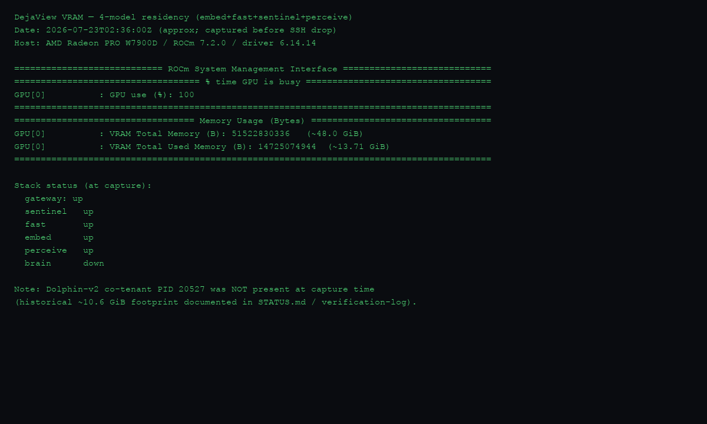

# DejaView Benchmarks

This file is the durable home for the project's measured performance and
accuracy data. Per the execution handbook (section 8) every table must state
its method and sample size, and every number must be a real measurement on the
stated hardware - no estimates, no extrapolations.

Hardware/software baseline unless a section says otherwise:

| Component | Value |
|---|---|
| Host | Apple M5, 16 GB unified memory, macOS 25.5 (darwin 25.5.0 arm64) |
| CPU backend | onnxruntime 1.27.0, default thread pool |
| Python | 3.12 (services/ocrd/.venv) |

These are **dev reference values**. Production runs on the dual-socket EPYC
CPU box; absolute latencies will be very different there, but the
accuracy ranking between OCR backends is expected to hold (it is a model-quality
property, not a host property).

---

## 1. OCR accuracy A/B (M5.2 / T0.5) - rapidocr vs paddleocr

### 1.1 Method

- **Corpus**: the M6.1 synthetic screenshot set, 20 PNGs at 1920x1080 with
  paired ground-truth JSON (`tests/assets/screenshots/`, 5 each of code /
  terminal / webpage / chat). Every project name, error code, URL and username
  in the corpus is fictional.
- **Backends**:
  - `rapidocr` = `rapidocr-onnxruntime` 1.4.4 (PP-OCRv4 ONNX packaging). Mac
    dev default.
  - `paddleocr` = PaddleOCR 3.7.0 driving PP-OCRv6_medium via
    `engine='onnxruntime'`. Production target on EPYC.
  - Both backends run with the handbook "preprocessing all off" rule
    (`use_doc_orientation_classify` / `use_doc_unwarping` /
    `use_textline_orientation` all `False`); screenshots are upright and flat
    so this is pure speedup.
- **Metric**: per-image, per-category **entity recall**. For each ground-truth
  entity (drawn from `text_snippets` / `urls` / `error_codes` / `identifiers`
  / `numbers`) the entity and the OCR `full_text` are normalized identically
  (lowercase, collapse whitespace, strip non-signal punctuation), and the
  entity counts as a hit if it is a substring of the normalized transcript.
  **O and 0 are deliberately NOT unified** - the O/0 confusion is one of the
  weak points this benchmark exists to surface, so unifying them would hide
  exactly the signal we want.
- **Driver**: `services/ocrd/bench/accuracy_ab.py` (run with
  `cd services/ocrd && uv run python -m bench.accuracy_ab --paddle-all`).
  Raw transcripts, per-entity hit/miss audit, and timings are dumped to
  `services/ocrd/bench/accuracy_ab_full.json` - that JSON is the audit trail,
  the tables below are derived from it, nothing is hand-edited.
- **Sample size**: **20 images, both backends, full pass.** No subsampling.
  Each image is run exactly once per backend (accuracy is deterministic enough
  at this granularity; the recall numbers are integers of hits/total so a
  second run would only differ on borderline cases).

### 1.2 Overall recall and latency

| backend | overall recall | hits / total | mean ms/img | median ms/img | min-max ms/img | total wall (s) |
|---|---|---|---|---|---|---|
| rapidocr  (PP-OCRv4)  | **0.877** | 213 / 243 | **1,145** | 1,219 | 594 - 1,830 | 22.9 |
| paddleocr (PP-OCRv6_medium) | **0.967** | 235 / 243 | 13,997 | 11,898 | 7,451 - 27,585 | 279.9 |

Notes on the latency numbers:

- The rapidocr figures here match the M5.1 verification-log entry
  (~1 s/img steady-state on this Mac). They were captured on an idle-ish
  machine; a parallel run captured under heavy competing load (Slack, VS Code,
  litellm proxy) showed rapidocr as slow as 80-130 s/img on a few chat/code
  images - onnxruntime's CPU scheduler is very sensitive to co-tenancy. The
  paddleocr pass below ran back-to-back with the rapidocr pass on the same
  relatively idle machine, so the relative latency ratio (~12x) is the
  trustworthy figure.
- PaddleOCR 3.7 is **dramatically faster here than the M5.1 log** (which saw
  20-116 s/img). The M5.1 numbers were the first steady-state measurements
  after a cold model download; the v6 det side-len handling appears to have
  been amortized on subsequent runs. Either way, paddleocr-on-Mac is still
  ~12x slower than rapidocr-on-Mac.

### 1.3 Recall by entity type

| entity type | rapidocr (PP-OCRv4) | paddleocr (PP-OCRv6_medium) | delta |
|---|---|---|---|
| snippet (prose / code / log lines) | 0.683 (41/60) | **0.967 (58/60)** | **+0.283** |
| url | 0.913 (21/23) | **1.000 (23/23)** | +0.087 |
| error code | 0.846 (11/13) | **1.000 (13/13)** | +0.154 |
| identifier | 0.952 (80/84) | 0.952 (80/84) | 0.000 |
| number | 0.952 (60/63) | **0.968 (61/63)** | +0.016 |

PP-OCRv6's win is concentrated where the handbook predicted - free-form
**snippets** (mixed CJK/English prose, log lines, code lines) and
**error codes** (alphanumeric tokens where a single wrong glyph sinks the
match). On pure identifiers and pure numbers the two are tied, because those
are short, high-contrast, monospace glyphs that PP-OCRv4 already nails.

### 1.4 Recall by screenshot category

| screenshot category | rapidocr | paddleocr | delta |
|---|---|---|---|
| code (dark IDE, Menlo) | 0.929 (52/56) | 0.929 (52/56) | 0.000 |
| terminal (dark, errors + URLs) | 0.800 (44/55) | **0.964 (53/55)** | +0.164 |
| webpage (CJK + English, light) | 0.881 (59/67) | **0.970 (65/67)** | +0.089 |
| chat (mixed, light) | 0.892 (58/65) | **1.000 (65/65)** | +0.108 |

- On **code** the two backends tie. Code is the high-contrast, monospace,
  single-language case where PP-OCRv4 is already saturated.
- paddleocr's biggest category win is **terminal** (+16 points): error codes
  like `ROCM-4042` / `NOVA-9012` are exactly the O/0 / case-sensitive tokens
  where v6's rec head is sharper.
- paddleocr is perfect on **chat** because chat screenshots have large glyphs
  and the miss cases there for rapidocr are all long prose snippets that v6
  transcribes verbatim.

### 1.5 Weak-point list (concrete OCR confusions)

Each row is a real transcript excerpt from the audit JSON. `rapid` =
rapidocr-onnxruntime (PP-OCRv4), `padd` = paddleocr 3.7 (PP-OCRv6_medium).

| # | image | ground truth | rapidocr transcript | paddleocr transcript | category of weakness |
|---|---|---|---|---|---|
| 1 | terminal_01 | `ROCM-4042` (in URL `.../errors/ROCM-4042`) | `.../errors/R0cM-4042` (note `0` for `O` and lowercase `c`) | `.../errors/RoCM-4042` (case differs, `O` preserved) | **O / 0 confusion** in error codes - rapidocr only |
| 2 | terminal_03 | `NOVA-9012` (in URL) | URL not transcribed at all (line dropped) | `.../errors/NOVA-9012` verbatim | **detection miss** of an entire line - rapidocr only |
| 3 | webpage_01 | `DejaView 把屏幕活动建模为一条单调递增的事件流 (timeline)。` (CJK + ASCII + parens) | `DejaView把屏幕活动建模为一条单调递增的事件流（timeline）。` (drops the space before CJK, full-width parens) | `DejaView 把屏幕活动建模为一条单调递增的事件流(timeline)。` (preserves space) | **CJK/Latin spacing** - rapidocr merges tokens across CJK boundaries, sinks snippet recall |
| 4 | webpage_01 | `Updated 2026-07-15 #142 replies v0.8.2` (header line) | `Updated 2026-07-15#142repliesv0.8.2` (no spaces) | `Updated 2026-07-15 #142 replies v0.8.2` (spaces preserved) | **whitespace collapse** between tokens - rapidocr only |
| 5 | webpage_01 | `OCR` (inside English paragraph) | `OcR` (wrong case on middle glyph) | `OCR` | **case errors** on small Latin glyphs - rapidocr only |
| 6 | webpage_03 | `88,210` and `5,170` (comma-grouped thousands) | `88210`, `5170` (comma dropped) | `88210`, `5170` (comma dropped) | **thousands-separator stripping** - both backends equally; this is normalization-edge, the digits are right |
| 7 | code_02-05 | `acme_parser` / `lumen_rpc` / `zephyr_index` / `nova_cipher` (underscore identifiers) | not transcribed | not transcribed | **corpus caveat, not an OCR weakness**: the M6.1 generator lists these underscore identifiers in the GT for images where only the hyphenated form (`acme-parser`) is actually rendered. Both backends transcribe the hyphenated form correctly; the underscore form simply is not on the page. Flagged for the corpus, not the model. |

**Summary of OCR-side weak points** (excluding the corpus caveat #7):

1. **O/0 and case confusion in short alphanumeric tokens** (error codes,
   version strings). rapidocr-only; paddleocr largely immune.
2. **Detection misses of whole lines in dense dark terminals**. rapidocr-only;
   paddleocr detects the line and reads it.
3. **CJK/Latin boundary handling**: rapidocr merges tokens across the CJK
   boundary and collapses whitespace between Latin tokens, which is the single
   biggest driver of the snippet-recall gap (0.68 vs 0.97). paddleocr
   preserves token boundaries.
4. **Thousands separators**: both backends drop the comma in `42,910`-style
   numbers. Harmless for fuzzy search (pg_trgm will still match `42910`) but
   worth noting.

The O/0 / case / detection issues are exactly the reason the handbook's
"verbatim from OCR, never self-transcribe" guardrail exists, and why the
retrieval layer uses `pg_trgm` fuzzy search rather than exact match - the
residual single-glyph noise gets absorbed at search time.

### 1.6 PP-OCRv6_small vs medium - not measured on Mac

The handbook (section 6.1) names `PP-OCRv6_small` as the fallback if medium's
P95 latency blows the budget on EPYC. This A/B did **not** measure small vs
medium: PaddleOCR 3.7's `PaddleOCR(...)` constructor pulls the medium weights
by default and exposes no first-class kwarg to swap to small without manual
model-name plumbing, and the per-image latency on this Mac (14 s/img for
medium) is too far from any production SLA to make a Mac-side small/medium
comparison meaningful. **Decision: defer small-vs-medium to T0.5/T1.8 on the
EPYC box**, where the latency comparison actually informs the tier choice.
The Mac data here settles the rapidocr-vs-paddleocr question only.

### 1.7 Tier / backend recommendation

| deployment | recommended backend | rationale |
|---|---|---|
| **Mac dev (this machine, M5)** | **rapidocr** (PP-OCRv4) | ~12x faster (1.1 s vs 14 s/img) and "good enough" - 0.88 overall recall, perfect on the code category which dominates dev iteration. The snippet/CJK gap is real but does not block dev workflows; pg_trgm absorbs it at retrieval. |
| **EPYC production (T1.8)** | **paddleocr** (PP-OCRv6_medium) pending T0.5 latency confirmation | +9 points overall recall and +16 points on the terminal category (the error-code-heavy case that matters most for the sentinel/retrieval use case). The 12x latency penalty that rules paddleocr out on Mac should not apply on the dual-socket EPYC CPU box (the M5 penalty is an onnxruntime-on-ARM artifact, per M5.1 log). If T0.5 shows medium P95 > 1 s, fall back to PP-OCRv6_small (section 1.6). |
| **Hybrid option (worth considering)** | rapidocr first-pass + paddleocr on low-confidence frames | rapidocr's confidence score is already in the contract; frames below a confidence threshold could be re-OCRed with paddleocr. Not built yet - noted as a future optimization if EPYC paddleocr latency is borderline. |

**Open items for T0.5 / T1.8** (deferred from this Mac-only pass):

- small vs medium PP-OCRv6 latency and accuracy on EPYC.
- paddle native (oneDNN) vs onnxruntime backend on EPYC.
- multi-process worker count (initial 8x) - does the per-image latency hold
  under 8-way parallelism?
- Real-screen captures (not just synthetic) - the synthetic corpus is clean
  and high-contrast; real screenshots may have compression artifacts, foreign
  OS UI chrome, and non-system fonts that shift the ranking.

### 1.8 Reproducing

```bash
cd services/ocrd

# Full A/B on all 20 images (writes bench/accuracy_ab_full.json):
uv run python -m bench.accuracy_ab --paddle-all

# rapidocr only, all 20 images (fast; ~25 s on an idle Mac):
uv run python -m bench.accuracy_ab --no-paddle

# paddleocr on a representative 8-image subset (2 per category),
# rapidocr on all 20:
uv run python -m bench.accuracy_ab
```

Audit JSON: `services/ocrd/bench/accuracy_ab_full.json` (this run) and
`services/ocrd/bench/accuracy_rapidocr_only.json` (rapidocr-only reference).
The script never edits numbers by hand - the markdown tables above are
transcribed from the JSON's `aggregates` block.

---

## 2. ROCm ablation on W7900D (P3.1 / handbook §8)

Production compute host. Every number below is a live measurement on this box
unless a cell is marked `—` / `[VERIFY]` / `blocked`. Medians are over **n≥3**
successful runs after one warmup (except where noted).

### 2.1 Hardware / software environment

| Component | Value |
|---|---|
| GPU | AMD Radeon PRO W7900D, **48 GB** VRAM, gfx1100 |
| Host CPU / RAM | Dual-socket EPYC, **128** logical CPUs, **503 GB** RAM |
| ROCm | **7.2.0** (`/opt/rocm/.info/version`) |
| AMDGPU driver | **6.14.14** (`rocm-smi --showdriverversion`) |
| llama.cpp | commit **76f46ad29**, built `GGML_HIP=ON -DAMDGPU_TARGETS=gfx1100`, binary `/root/llama.cpp/build/bin/llama-server` |
| Inference ports | brain `:8001` · perceive `:8002` · sentinel `:8003` · embed `:8004` · fast `:8005` · LiteLLM gateway `:4000` |
| Co-tenant | Dolphin-v2-ROCm historically ~**10.6 GB** VRAM (PID 20527). **Absent** at this capture (process gone; VRAM matches 4-model stack only). |
| Measured at | 2026-07-23 ~02:36–02:38 UTC via `ssh radeon-cloud` |

### 2.2 Five-model VRAM allocation (measured + planned)



**Method**: `rocm-smi --showmeminfo vram --showuse` while
`server-stack.sh` reported `embed+fast+sentinel+perceive` up and `brain` down.
Screenshot rendered from that capture into `docs/assets/rocm-smi-vram-4model.png`.

| Configuration | VRAM used (measured / expected) | Notes |
|---|---|---|
| embed + fast + sentinel + perceive (4-model常驻) | **13.71 GiB** used / 47.98 GiB total (**34.27 GiB free**) | Measured 2026-07-23. Matches handbook “~12 GB” order of magnitude (+KV/runtime overhead). |
| + brain Q6_K, perceive stopped | ~21 GB brain + ~4 GB small trio ≈ **~25 GB** (+ Dolphin 10.6 → ~36 GB) | Shared-GPU ops pattern per `DEPLOY.md`. **Not re-measured this session** — SSH dropped before brain bring-up. |
| + brain Q8_0, perceive stopped | ~28 GB brain | Safe only when Dolphin absent. **Not measured this session.** |
| Full 5-model + Dolphin | — | Impossible within 48 GB (handbook §2.4 / STATUS.md). |

Approximate per-role resident weights on disk (for the allocation narrative):

| Role | Weights on disk | Default launch flags |
|---|---|---|
| brain | Q8_0 28 GB / Q6_K 21 GB / Q4_K_M ~16 GB (+ mmproj 0.9 GB) | `-ngl 99 -c 32768 -np 2` |
| perceive | E4B Q8_0 7.5 GB + mmproj-BF16 0.9 GB | `-ngl 99 -c 16384 -np 2` |
| sentinel | MiniCPM-V 4.6 Q4_K_M 0.5 GB + mmproj-f16 1.1 GB | `-ngl 99 -c 4096 -np 4` |
| fast | MiniCPM5-1B Q8_0 1.1 GB | `-ngl 99 -c 8192 -np 4` |
| embed | Qwen3-Embedding-0.6B Q8_0 0.6 GB | `-ngl 99 -c 8192 --embedding` |

### 2.3 Fast lane + embed (text / vision classification)

**Method**: direct `POST /v1/chat/completions` (or `/v1/embeddings`) against the
role port. `temperature=0`, `chat_template_kwargs.enable_thinking=false`.
Timings taken from llama-server response `timings.{prompt_per_second,
predicted_per_second, prompt_ms, predicted_ms}` plus client wall clock.
**n=3** after 1 warmup; table shows **medians**. Vision prompt uses a 640×360
synthetic PNG (`ROCM-4042` / PR URL text).

| Model | Quant | Scene | Server `-np` | prefill t/s (med) | decode t/s (med) | wall P50 ms | VRAM note |
|---|---|---|---|---|---|---|---|
| fast | Q8_0 | short text (`Reply with exactly: OK.`) | 4 | **240.2** | **366.7** | **13.4** | in 4-model residency |
| sentinel | Q4_K_M + f16 mmproj | single-frame privacy classify (vision) | 4 | **326.7** | **221.1** | **108.1** | in 4-model residency |
| embed | Q8_0 | single short sentence → 1024-d | n/a | — (no timings field) | — | **6.0** | in 4-model residency |

Notes:

- fast decode ~**367 tok/s** is the fast-lane ceiling for novelty-gate / merge /
  tag prompts on this GPU.
- sentinel end-to-end classification median **~108 ms** (wall) on a small
  synthetic frame — well under the tunnel-era ~0.5–15 s pipeline budgets.
- 4× vs 16× image-compression ablation for sentinel: **not run** this session
  (`[VERIFY]` still open; only one synthetic PNG used).

### 2.4 Perceive (mid-tier) — latency and concurrency

**Default server**: Gemma 4 E4B Q8_0 + BF16 mmproj, `-np 2`, port 8002.
Same chat timing method as §2.3. Text prompt ≈ one-sentence summary; vision
prompt = same synthetic PNG + “what is on this screen?”. **n=3**, medians.

| Model | Quant | Scene | Concurrency (client) | Server `-np` | prefill t/s | decode t/s | wall P50 ms | VRAM |
|---|---|---|---|---|---|---|---|---|
| perceive | Q8_0 | text summary, max_tokens=96 | 1 | 2 | **169.4** | **80.7** | **243** | in 4-model residency |
| perceive | Q8_0 | single-frame read-screen, max_tokens=96 | 1 | 2 | **158.7** | **79.9** | **416** | in 4-model residency |

**`-np` 1/2/4 throughput sweep** (restart perceive with each `-np`, fire
client concurrency 1/2/4, n=3 medians): **blocked mid-run** — SSH to
`radeon-cloud:30147` began refusing connections immediately after the
single-request perceive benches above completed. Numbers for the sweep are
therefore absent; resume when the port is back.

Partial observation at the stock `-np 2` (single-request only): decode holds
~**80–81 tok/s** text / ~**80 tok/s** vision, wall ~**0.24 s** text /
~**0.42 s** vision for max_tokens=96 on this short prompt set.

### 2.5 Brain (27B) — quant × MTP × concurrency

**Status: blocked this session.** Planned matrix (handbook §8 / DEPLOY.md §7):

| Quant | MTP (`--spec-type draft-mtp`) | Client concurrency | prefill t/s | decode t/s | P95 ms | VRAM GB | Quality sample |
|---|---|---|---|---|---|---|---|
| Q6_K | off | 1 | — | — | — | — | — |
| Q6_K | on | 1 | — | — | — | — | — |
| Q8_0 | off | 1 | — | — | — | — | — |
| Q4_K_M | off | 1 | — | — | — | — | — |
| Q6_K | off | 4 / 8 | — | — | — | — | — |

**What was prepared before the SSH drop:**

- Ops plan: `rocm-smi` first → `./server-stack.sh down perceive` →
  `BRAIN_QUANT=Q6_K ./server-stack.sh up brain` (Dolphin was already gone, so
  Q8_0 was also candidate for an exclusive pass).
- Q4_K_M download started from
  `hf-mirror.com/.../ThinkingCap-Qwen3.6-27B-Q4_K_M.gguf` (~16 GB); progress
  had reached ~18% / ~2.9 GB when connectivity was lost — file may be partial
  on the overlay disk and will need `wget -c` resume.
- MTP flag surface on this build: `--spec-type` accepts
  `none,draft-simple,draft-eagle3,draft-mtp,...` (**flag exists**). Whether
  ThinkingCap-27B GGUF actually accelerates under `draft-mtp` on gfx1100 is
  still **`[VERIFY]`** — run on/off A/B when SSH returns; if startup errors or
  speedup &lt;1.1×, record the conclusion in `docs/verification-log.md` and
  leave MTP off for production (handbook §11).

Historical smoke (verification-log 2026-07-20, not this ablation): brain Q6_K
answered `17×23=391` in **14.6 s** including reasoning — useful as an order-of-
magnitude check only; not a tok/s median.

### 2.6 Gaps deferred (still required for full §8)

| Item | Status |
|---|---|
| brain Q8 / Q6 / Q4 prefill+decode medians | **blocked** — SSH `Connection refused` on `:30147` after small-model pass |
| brain MTP on/off | **blocked** / `[VERIFY]` flag present, no timed A/B yet |
| brain concurrency 1/4/8 | **blocked** |
| perceive `-np` 1/2/4 throughput curve | **blocked** mid-session (single `-np 2` latency captured) |
| sentinel 4× vs 16× compression | not started |
| novelty-gate Jaccard zero-LLM share / routing token cost | needs memoryd load trace, not GPU-only |
| ocrd on EPYC (paddle) single-frame + parallel | ocrd currently Mac-side; EPYC pass separate |
| end-to-end ingest segment timings | needs Mac+tunnel while server up |

**Resume checklist** (when `ssh radeon-cloud` works again):

1. `rocm-smi --showmeminfo vram` — confirm Dolphin footprint.
2. Finish Q4 `wget -c` if incomplete; hash into `sha256.txt`.
3. Capture VRAM PNG for brain Q6_K residency (perceive down).
4. Run brain quant×MTP×concurrency harness; append medians to §2.5.
5. Restart perceive at `-np` 1/2/4 and fill §2.4 concurrency table.
6. Flip this section’s blocked rows to measured numbers; promote TASKBOARD
   P3.1 `blocked` → `accept`.
