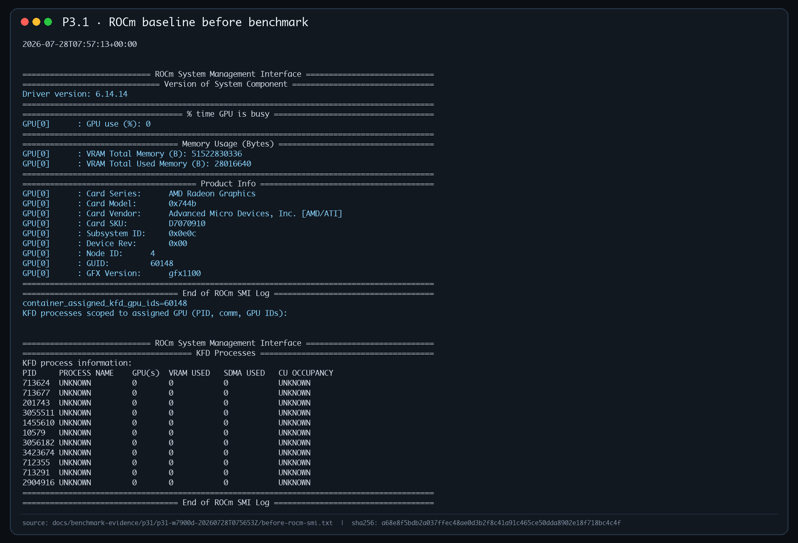
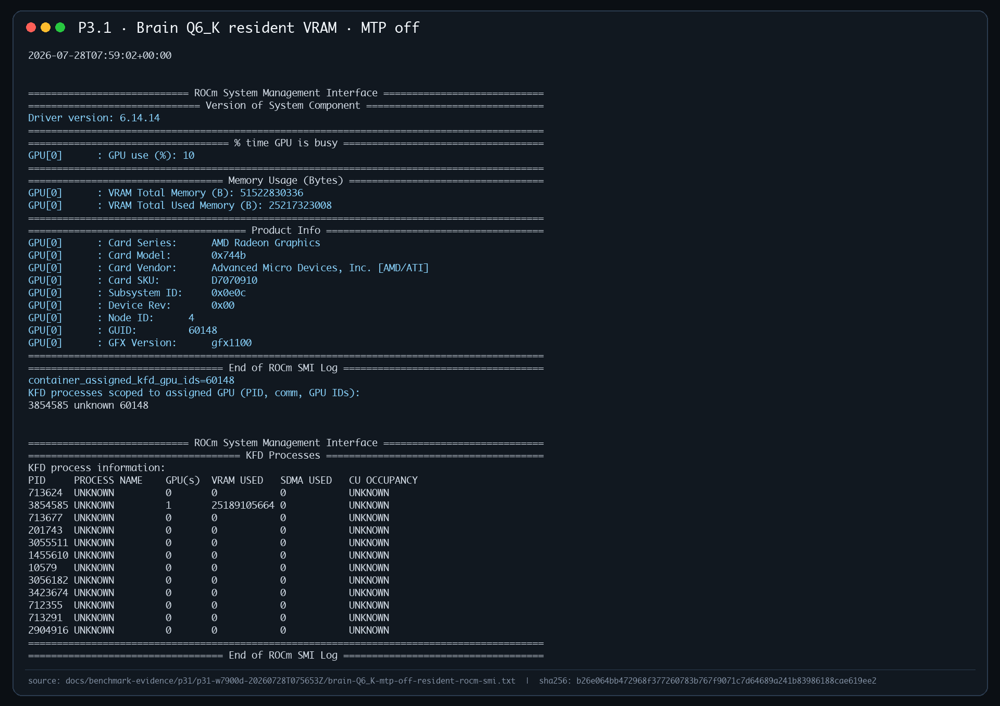
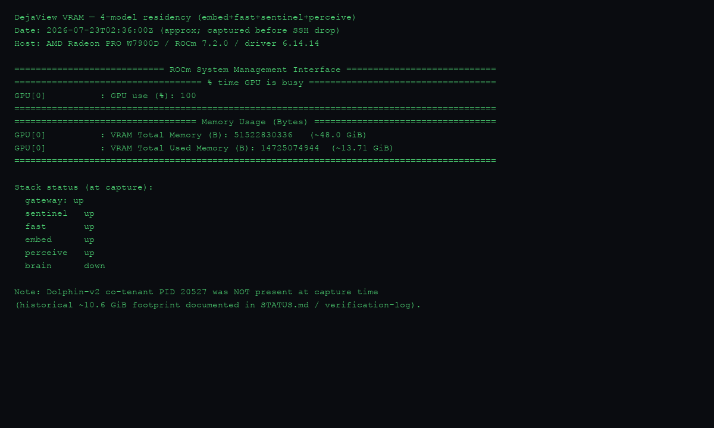

# DejaView Benchmarks

This file is the durable home for the project's measured performance and
accuracy data. Per the execution handbook (section 8) every table must state
its method and sample size, and every number must be a real measurement on the
stated hardware - no estimates, no extrapolations.

Hardware/software baseline unless a section says otherwise:

| Component | Value |
|---|---|
| Host | Apple M5, 16 GB unified memory, macOS 25.5 (darwin 25.5.0 arm64) |
| CPU backend | onnxruntime 1.27.0, default thread pool |
| Python | 3.12 (services/ocrd/.venv) |

These are **dev reference values**. Production runs on the dual-socket EPYC
CPU box; absolute latencies will be very different there, but the
accuracy ranking between OCR backends is expected to hold (it is a model-quality
property, not a host property).

---

## 1. OCR accuracy A/B (M5.2 / T0.5) - rapidocr vs paddleocr

### 1.1 Method

- **Corpus**: the M6.1 synthetic screenshot set, 20 PNGs at 1920x1080 with
  paired ground-truth JSON (`tests/assets/screenshots/`, 5 each of code /
  terminal / webpage / chat). Every project name, error code, URL and username
  in the corpus is fictional.
- **Backends**:
  - `rapidocr` = `rapidocr-onnxruntime` 1.4.4 (PP-OCRv4 ONNX packaging). Mac
    dev default.
  - `paddleocr` = PaddleOCR 3.7.0 driving PP-OCRv6_medium via
    `engine='onnxruntime'`. Production target on EPYC.
  - Both backends run with the handbook "preprocessing all off" rule
    (`use_doc_orientation_classify` / `use_doc_unwarping` /
    `use_textline_orientation` all `False`); screenshots are upright and flat
    so this is pure speedup.
- **Metric**: per-image, per-category **entity recall**. For each ground-truth
  entity (drawn from `text_snippets` / `urls` / `error_codes` / `identifiers`
  / `numbers`) the entity and the OCR `full_text` are normalized identically
  (lowercase, collapse whitespace, strip non-signal punctuation), and the
  entity counts as a hit if it is a substring of the normalized transcript.
  **O and 0 are deliberately NOT unified** - the O/0 confusion is one of the
  weak points this benchmark exists to surface, so unifying them would hide
  exactly the signal we want.
- **Driver**: `services/ocrd/bench/accuracy_ab.py` (run with
  `cd services/ocrd && uv run python -m bench.accuracy_ab --paddle-all`).
  Raw transcripts, per-entity hit/miss audit, and timings are dumped to
  `services/ocrd/bench/accuracy_ab_full.json` - that JSON is the audit trail,
  the tables below are derived from it, nothing is hand-edited.
- **Sample size**: **20 images, both backends, full pass.** No subsampling.
  Each image is run exactly once per backend (accuracy is deterministic enough
  at this granularity; the recall numbers are integers of hits/total so a
  second run would only differ on borderline cases).

### 1.2 Overall recall and latency

| backend | overall recall | hits / total | mean ms/img | median ms/img | min-max ms/img | total wall (s) |
|---|---|---|---|---|---|---|
| rapidocr  (PP-OCRv4)  | **0.877** | 213 / 243 | **1,145** | 1,219 | 594 - 1,830 | 22.9 |
| paddleocr (PP-OCRv6_medium) | **0.967** | 235 / 243 | 13,997 | 11,898 | 7,451 - 27,585 | 279.9 |

Notes on the latency numbers:

- The rapidocr figures here match the M5.1 verification-log entry
  (~1 s/img steady-state on this Mac). They were captured on an idle-ish
  machine; a parallel run captured under heavy competing load (Slack, VS Code,
  litellm proxy) showed rapidocr as slow as 80-130 s/img on a few chat/code
  images - onnxruntime's CPU scheduler is very sensitive to co-tenancy. The
  paddleocr pass below ran back-to-back with the rapidocr pass on the same
  relatively idle machine, so the relative latency ratio (~12x) is the
  trustworthy figure.
- PaddleOCR 3.7 is **dramatically faster here than the M5.1 log** (which saw
  20-116 s/img). The M5.1 numbers were the first steady-state measurements
  after a cold model download; the v6 det side-len handling appears to have
  been amortized on subsequent runs. Either way, paddleocr-on-Mac is still
  ~12x slower than rapidocr-on-Mac.

### 1.3 Recall by entity type

| entity type | rapidocr (PP-OCRv4) | paddleocr (PP-OCRv6_medium) | delta |
|---|---|---|---|
| snippet (prose / code / log lines) | 0.683 (41/60) | **0.967 (58/60)** | **+0.283** |
| url | 0.913 (21/23) | **1.000 (23/23)** | +0.087 |
| error code | 0.846 (11/13) | **1.000 (13/13)** | +0.154 |
| identifier | 0.952 (80/84) | 0.952 (80/84) | 0.000 |
| number | 0.952 (60/63) | **0.968 (61/63)** | +0.016 |

PP-OCRv6's win is concentrated where the handbook predicted - free-form
**snippets** (mixed CJK/English prose, log lines, code lines) and
**error codes** (alphanumeric tokens where a single wrong glyph sinks the
match). On pure identifiers and pure numbers the two are tied, because those
are short, high-contrast, monospace glyphs that PP-OCRv4 already nails.

### 1.4 Recall by screenshot category

| screenshot category | rapidocr | paddleocr | delta |
|---|---|---|---|
| code (dark IDE, Menlo) | 0.929 (52/56) | 0.929 (52/56) | 0.000 |
| terminal (dark, errors + URLs) | 0.800 (44/55) | **0.964 (53/55)** | +0.164 |
| webpage (CJK + English, light) | 0.881 (59/67) | **0.970 (65/67)** | +0.089 |
| chat (mixed, light) | 0.892 (58/65) | **1.000 (65/65)** | +0.108 |

- On **code** the two backends tie. Code is the high-contrast, monospace,
  single-language case where PP-OCRv4 is already saturated.
- paddleocr's biggest category win is **terminal** (+16 points): error codes
  like `ROCM-4042` / `NOVA-9012` are exactly the O/0 / case-sensitive tokens
  where v6's rec head is sharper.
- paddleocr is perfect on **chat** because chat screenshots have large glyphs
  and the miss cases there for rapidocr are all long prose snippets that v6
  transcribes verbatim.

### 1.5 Weak-point list (concrete OCR confusions)

Each row is a real transcript excerpt from the audit JSON. `rapid` =
rapidocr-onnxruntime (PP-OCRv4), `padd` = paddleocr 3.7 (PP-OCRv6_medium).

| # | image | ground truth | rapidocr transcript | paddleocr transcript | category of weakness |
|---|---|---|---|---|---|
| 1 | terminal_01 | `ROCM-4042` (in URL `.../errors/ROCM-4042`) | `.../errors/R0cM-4042` (note `0` for `O` and lowercase `c`) | `.../errors/RoCM-4042` (case differs, `O` preserved) | **O / 0 confusion** in error codes - rapidocr only |
| 2 | terminal_03 | `NOVA-9012` (in URL) | URL not transcribed at all (line dropped) | `.../errors/NOVA-9012` verbatim | **detection miss** of an entire line - rapidocr only |
| 3 | webpage_01 | `DejaView 把屏幕活动建模为一条单调递增的事件流 (timeline)。` (CJK + ASCII + parens) | `DejaView把屏幕活动建模为一条单调递增的事件流（timeline）。` (drops the space before CJK, full-width parens) | `DejaView 把屏幕活动建模为一条单调递增的事件流(timeline)。` (preserves space) | **CJK/Latin spacing** - rapidocr merges tokens across CJK boundaries, sinks snippet recall |
| 4 | webpage_01 | `Updated 2026-07-15 #142 replies v0.8.2` (header line) | `Updated 2026-07-15#142repliesv0.8.2` (no spaces) | `Updated 2026-07-15 #142 replies v0.8.2` (spaces preserved) | **whitespace collapse** between tokens - rapidocr only |
| 5 | webpage_01 | `OCR` (inside English paragraph) | `OcR` (wrong case on middle glyph) | `OCR` | **case errors** on small Latin glyphs - rapidocr only |
| 6 | webpage_03 | `88,210` and `5,170` (comma-grouped thousands) | `88210`, `5170` (comma dropped) | `88210`, `5170` (comma dropped) | **thousands-separator stripping** - both backends equally; this is normalization-edge, the digits are right |
| 7 | code_02-05 | `acme_parser` / `lumen_rpc` / `zephyr_index` / `nova_cipher` (underscore identifiers) | not transcribed | not transcribed | **corpus caveat, not an OCR weakness**: the M6.1 generator lists these underscore identifiers in the GT for images where only the hyphenated form (`acme-parser`) is actually rendered. Both backends transcribe the hyphenated form correctly; the underscore form simply is not on the page. Flagged for the corpus, not the model. |

**Summary of OCR-side weak points** (excluding the corpus caveat #7):

1. **O/0 and case confusion in short alphanumeric tokens** (error codes,
   version strings). rapidocr-only; paddleocr largely immune.
2. **Detection misses of whole lines in dense dark terminals**. rapidocr-only;
   paddleocr detects the line and reads it.
3. **CJK/Latin boundary handling**: rapidocr merges tokens across the CJK
   boundary and collapses whitespace between Latin tokens, which is the single
   biggest driver of the snippet-recall gap (0.68 vs 0.97). paddleocr
   preserves token boundaries.
4. **Thousands separators**: both backends drop the comma in `42,910`-style
   numbers. Harmless for fuzzy search (pg_trgm will still match `42910`) but
   worth noting.

The O/0 / case / detection issues are exactly the reason the handbook's
"verbatim from OCR, never self-transcribe" guardrail exists, and why the
retrieval layer uses `pg_trgm` fuzzy search rather than exact match - the
residual single-glyph noise gets absorbed at search time.

### 1.6 PP-OCRv6_small vs medium - not measured on Mac

The handbook (section 6.1) names `PP-OCRv6_small` as the fallback if medium's
P95 latency blows the budget on EPYC. This A/B did **not** measure small vs
medium: PaddleOCR 3.7's `PaddleOCR(...)` constructor pulls the medium weights
by default and exposes no first-class kwarg to swap to small without manual
model-name plumbing, and the per-image latency on this Mac (14 s/img for
medium) is too far from any production SLA to make a Mac-side small/medium
comparison meaningful. **Decision: defer small-vs-medium to T0.5/T1.8 on the
EPYC box**, where the latency comparison actually informs the tier choice.
The Mac data here settles the rapidocr-vs-paddleocr question only.

### 1.7 Tier / backend recommendation

| deployment | recommended backend | rationale |
|---|---|---|
| **Mac dev (this machine, M5)** | **rapidocr** (PP-OCRv4) | ~12x faster (1.1 s vs 14 s/img) and "good enough" - 0.88 overall recall, perfect on the code category which dominates dev iteration. The snippet/CJK gap is real but does not block dev workflows; pg_trgm absorbs it at retrieval. |
| **EPYC production (T1.8)** | **paddleocr** (PP-OCRv6_medium) pending T0.5 latency confirmation | +9 points overall recall and +16 points on the terminal category (the error-code-heavy case that matters most for the sentinel/retrieval use case). The 12x latency penalty that rules paddleocr out on Mac should not apply on the dual-socket EPYC CPU box (the M5 penalty is an onnxruntime-on-ARM artifact, per M5.1 log). If T0.5 shows medium P95 > 1 s, fall back to PP-OCRv6_small (section 1.6). |
| **Hybrid option (worth considering)** | rapidocr first-pass + paddleocr on low-confidence frames | rapidocr's confidence score is already in the contract; frames below a confidence threshold could be re-OCRed with paddleocr. Not built yet - noted as a future optimization if EPYC paddleocr latency is borderline. |

**Open items for T0.5 / T1.8** (deferred from this Mac-only pass):

- small vs medium PP-OCRv6 latency and accuracy on EPYC.
- paddle native (oneDNN) vs onnxruntime backend on EPYC.
- multi-process worker count (initial 8x) - does the per-image latency hold
  under 8-way parallelism?
- Real-screen captures (not just synthetic) - the synthetic corpus is clean
  and high-contrast; real screenshots may have compression artifacts, foreign
  OS UI chrome, and non-system fonts that shift the ranking.

### 1.8 Reproducing

```bash
cd services/ocrd

# Full A/B on all 20 images (writes bench/accuracy_ab_full.json):
uv run python -m bench.accuracy_ab --paddle-all

# rapidocr only, all 20 images (fast; ~25 s on an idle Mac):
uv run python -m bench.accuracy_ab --no-paddle

# paddleocr on a representative 8-image subset (2 per category),
# rapidocr on all 20:
uv run python -m bench.accuracy_ab
```

Audit JSON: `services/ocrd/bench/accuracy_ab_full.json` (this run) and
`services/ocrd/bench/accuracy_rapidocr_only.json` (rapidocr-only reference).
The script never edits numbers by hand - the markdown tables above are
transcribed from the JSON's `aggregates` block.

---

## 2. ROCm ablation on W7900D (P3.1 / handbook §8)

The authoritative P3.1 campaign is the successful `mode=all` run
`p31-w7900d-20260728T075653Z`. It contains the complete 18-cell brain factorial
and three perceive cells. No number from an incomplete or failed run is used in
the tables below. The earlier 2026-07-23 small-model pass is retained in §2.7 as
historical context and its former blocked status is superseded by this run.

### 2.1 Hardware, software, and evidence identity

| Component | Formal run value |
|---|---|
| Run / time | `p31-w7900d-20260728T075653Z`; 2026-07-28 07:57–08:28 UTC |
| GPU | AMD Radeon PRO W7900D, gfx1100; **51,522,830,336 B = 47.98 GiB** VRAM; assigned KFD GPU ID `60148` |
| Host | `u-4695-e6d1476b`; 2× AMD EPYC 9334, **128** logical CPUs; **1007.56 GiB** RAM |
| OS / ROCm / driver | Linux 6.8.0-79-generic; ROCm **7.2.1**; AMDGPU driver **6.14.14** |
| llama.cpp | commit `76f46ad29d61fd8c1401e8221842934bf62a6064`; Release build with `GGML_HIP=ON`, `AMDGPU_TARGETS=gfx1100` |
| Binary identity | `/root/llama.cpp/build/bin/llama-server`; SHA256 `90d82cee630d8340b0f1f629e4675a23b7189b49f2d9869ed6efb424cfdeb55f` |
| Model identity | Exact SHA256-verified Q8_0/Q6_K/Q4_K_M brain weights + f16 mmproj; perceive Q8_0 + **BF16** mmproj |
| Benchmark endpoints | Direct loopback brain `:18001`, perceive `:18002`; brain max tokens 256, perceive max tokens 96 |
| Entry state | All DejaView roles down; GPU 0%, **28,016,640 B** VRAM used; assigned-GPU KFD inventory empty |
| Raw evidence | [`p31-summary.md`](benchmark-evidence/p31/p31-w7900d-20260728T075653Z/p31-summary.md), [`run-manifest.txt`](benchmark-evidence/p31/p31-w7900d-20260728T075653Z/run-manifest.txt), and [`SHA256SUMS`](benchmark-evidence/p31/p31-w7900d-20260728T075653Z/SHA256SUMS) |





Both PNGs are deterministic renders of the corresponding checksummed text
captures in the raw-evidence directory; values were not retyped into the images.

### 2.2 Method and acceptance gates

- Brain is a full factorial: quant `{Q8_0,Q6_K,Q4_K_M}` × MTP `{off,on}` ×
  client concurrency `{1,4,8}` = **18 cells**. Perceive pairs server slots and
  client concurrency at `(1,1)`, `(2,2)`, and `(4,4)` = **3 cells**.
- Every cell runs one excluded warm-up batch followed by **n=3 measured
  batches**. Thus `n=3` is a batch count; a concurrency-8 row contains 24
  successful measured requests. Prefill/decode medians are over requests,
  aggregate output throughput is the median of the three batch-level
  end-to-end rates, and P95 is the nearest-rank request wall latency.
- Requests use synthetic prompts only, `temperature=0`,
  `chat_template_kwargs.enable_thinking=false`, and `cache_prompt=false`.
  Servers also use `--cache-ram 0 --no-cache-idle-slots`; every measured
  response reports `timings.cache_n=0`.
- Every server load is bound to the assigned KFD GPU through an exclusive KFD
  delta, uses the checksummed llama binary, logs ROCm/HIP, and proves full layer
  offload (`66/66` for brain; `43/43` for perceive). Resident and sampled peak
  VRAM are separate measurements.
- Brain's narrow compliance gate is the exact deterministic sequence `1..80`;
  all cells passed 100%. This is not a general reasoning/accuracy benchmark.
  Perceive uses one fixed image
  (`SHA256 d7903ab467f554b2fba7489380024c603c0ad3b8785ccb08f62af07cc976caf9`)
  and requires the visible text `parse.py`; all cells passed 100%. This is a
  visual-path grounding gate, not general VLM accuracy.
- MTP-on cells must emit draft tokens, MTP-off cells must emit none, and
  on/off response hashes are compared in request order. The fail-closed
  summarizer recomputed every reported metric from the raw batches before
  producing the formal summary.

### 2.3 Resident and sampled peak VRAM

Values are total assigned-GPU VRAM used, not just weight-file sizes. The entry
and exit baseline was the same **0.026 GiB** (28,016,640 B).

| Load | Resident GiB | Maximum sampled peak GiB | Peak cell |
|---|---:|---:|---|
| brain Q8_0, MTP off | 29.36 | 29.43 | c8 |
| brain Q8_0, MTP on | 34.31 | 34.43 | c8 |
| brain Q6_K, MTP off | 23.49 | 23.83 | c8 |
| brain Q6_K, MTP on | 28.44 | 29.23 | c8 |
| brain Q4_K_M, MTP off | 18.56 | 18.90 | c8 |
| brain Q4_K_M, MTP on | 23.51 | 24.10 | c8 |
| perceive Q8_0, `-np 1` / c1 | 6.38 | 6.51 | c1 |
| perceive Q8_0, `-np 2` / c2 | 6.41 | 6.55 | c2 |
| perceive Q8_0, `-np 4` / c4 | 6.48 | 6.62 | c4 |

MTP raises brain resident VRAM by **4.95 GiB** for every quant in this build.
The formal run was exclusive on the assigned GPU and deliberately kept all
other DejaView roles stopped, so these values must not be added to an
unmeasured co-tenant configuration without a fresh `rocm-smi` headroom check.

### 2.4 Brain (ThinkingCap-27B): quant × MTP × concurrency

| Quant | MTP | conc | prefill t/s | decode t/s/request | aggregate output t/s | request P95 ms | resident / peak VRAM GiB | draft accepted / generated | correct prefix / pass | n |
|---|---:|---:|---:|---:|---:|---:|---:|---:|---:|---:|
| Q8_0 | off | 1 | 173.4 | 21.4 | 20.9 | 11056.9 | 29.36 / 29.37 | — | 80 / 100% | 3 |
| Q8_0 | off | 4 | 55.7 | 15.1 | 56.8 | 16294.6 | 29.36 / 29.39 | — | 80 / 100% | 3 |
| Q8_0 | off | 8 | 30.4 | 10.0 | 74.5 | 24858.3 | 29.36 / 29.43 | — | 80 / 100% | 3 |
| Q8_0 | on | 1 | 117.6 | 45.1 | 42.2 | 5496.6 | 34.31 / 34.34 | 558 / 564 (98.9%) | 80 / 100% | 3 |
| Q8_0 | on | 4 | 44.1 | 15.0 | 56.0 | 16543.5 | 34.31 / 34.40 | 2232 / 2256 (98.9%) | 80 / 100% | 3 |
| Q8_0 | on | 8 | 22.7 | 9.9 | 72.5 | 25477.0 | 34.31 / 34.43 | 4464 / 4512 (98.9%) | 80 / 100% | 3 |
| Q6_K | off | 1 | 147.4 | 24.7 | 23.9 | 9654.7 | 23.49 / 23.50 | — | 80 / 100% | 3 |
| Q6_K | off | 4 | 51.1 | 13.7 | 51.3 | 18168.3 | 23.49 / 23.50 | — | 80 / 100% | 3 |
| Q6_K | off | 8 | 25.6 | 8.0 | 59.7 | 31064.3 | 23.49 / 23.83 | — | 80 / 100% | 3 |
| Q6_K | on | 1 | 104.0 | 44.8 | 41.6 | 5571.6 | 28.44 / 28.46 | 558 / 564 (98.9%) | 80 / 100% | 3 |
| Q6_K | on | 4 | 41.9 | 18.0 | 64.7 | 14305.6 | 28.44 / 28.47 | 2232 / 2256 (98.9%) | 80 / 100% | 3 |
| Q6_K | on | 8 | 23.1 | 10.7 | 77.1 | 23979.2 | 28.44 / 29.23 | 4464 / 4512 (98.9%) | 80 / 100% | 3 |
| Q4_K_M | off | 1 | 164.6 | 28.0 | 27.2 | 8507.9 | 18.56 / 18.57 | — | 80 / 100% | 3 |
| Q4_K_M | off | 4 | 52.3 | 13.2 | 49.8 | 18567.0 | 18.56 / 18.57 | — | 80 / 100% | 3 |
| Q4_K_M | off | 8 | 30.8 | 7.4 | 55.2 | 33494.4 | 18.56 / 18.90 | — | 80 / 100% | 3 |
| Q4_K_M | on | 1 | 114.3 | 42.8 | 40.1 | 5771.9 | 23.51 / 23.53 | 558 / 564 (98.9%) | 80 / 100% | 3 |
| Q4_K_M | on | 4 | 43.1 | 19.8 | 71.5 | 12937.0 | 23.51 / 23.54 | 2232 / 2256 (98.9%) | 80 / 100% | 3 |
| Q4_K_M | on | 8 | 23.5 | 11.5 | 83.0 | 22496.6 | 23.51 / 24.10 | 4464 / 4512 (98.9%) | 80 / 100% | 3 |

### 2.5 MTP ablation and production decision

The ratio is MTP-on / MTP-off aggregate end-to-end output throughput for the
same quant and client concurrency.

| Quant | concurrency | ratio |
|---|---:|---:|
| Q8_0 | 1 | 2.018× |
| Q8_0 | 4 | 0.986× |
| Q8_0 | 8 | 0.973× |
| Q6_K | 1 | 1.738× |
| Q6_K | 4 | 1.261× |
| Q6_K | 8 | 1.292× |
| Q4_K_M | 1 | 1.474× |
| Q4_K_M | 4 | 1.436× |
| Q4_K_M | 8 | 1.504× |

Deterministic MTP output parity is **PASS** for all nine pairs, and every
MTP-on cell accepted **98.9%** of generated draft tokens.

Production policy from this evidence:

- Keep the fixed product default **Q6_K**. MTP improves Q6_K aggregate
  throughput at c1/c4/c8 by 1.738×/1.261×/1.292×, so enable it for an exclusive
  or positively headroom-checked brain session.
- MTP costs 4.95 GiB resident VRAM. On a shared GPU (especially if Dolphin is
  present), stop perceive and leave MTP off unless post-load telemetry still
  satisfies the 6 GB reserve. Co-tenant performance was intentionally not
  tested.
- For Q8_0, enable MTP only for single-request work; c4 and c8 are slightly
  slower and use more memory, so multi-request Q8_0 stays MTP-off.
- Q4_K_M benefits at every tested concurrency and is the throughput/headroom
  fallback. Its 1..80 compliance pass does not establish parity on broader
  reasoning quality, so it does not replace Q6_K as the default brain.

### 2.6 Perceive (Gemma 4 E4B): `-np` and paired concurrency

Every row uses the exact Q8_0 model and BF16 mmproj, the same synthetic image,
and client concurrency equal to server slots.

| Quant | server `-np` | client conc | prefill t/s | decode t/s/request | aggregate output t/s | request P95 ms | resident / peak VRAM GiB | visual text pass | n |
|---|---:|---:|---:|---:|---:|---:|---:|---:|---:|
| Q8_0 | 1 | 1 | 1152.9 | 59.4 | 31.2 | 739.1 | 6.38 / 6.51 | 100% | 3 |
| Q8_0 | 2 | 2 | 581.8 | 46.8 | 40.7 | 1150.8 | 6.41 / 6.55 | 100% | 3 |
| Q8_0 | 4 | 4 | 430.4 | 32.8 | 50.0 | 1861.6 | 6.48 / 6.62 | 100% | 3 |

`-np 4` maximizes aggregate throughput (**50.0 t/s**) but reduces per-request
decode speed and raises request P95 to **1.86 s**. The fixed production default
remains **`-np 2`** as the balance point; use `-np 4` only when batch throughput
matters more than interactive latency.

### 2.7 Historical 2026-07-23 small-model pass (superseded)

This earlier successful subset used the previous server session and is retained
for fast/sentinel/embed context only. It is **not** mixed into the formal
2026-07-28 brain/perceive matrix.



| Model | Scene | prefill t/s | decode t/s | wall P50 ms | Note |
|---|---|---:|---:|---:|---|
| fast Q8_0 | short text | 240.2 | 366.7 | 13.4 | n=3 median |
| sentinel Q4_K_M + f16 mmproj | privacy classify, vision | 326.7 | 221.1 | 108.1 | n=3 median |
| embed Q8_0 | sentence → 1024-d | — | — | 6.0 | embeddings response had no llama timing fields |
| perceive Q8_0 | text summary | 169.4 | 80.7 | 243 | n=3 median |
| perceive Q8_0 | single-frame read-screen | 158.7 | 79.9 | 416 | n=3 median |

That capture measured the four-model residency at **13.71 / 47.98 GiB**. Its
subsequent SSH-blocked brain/perceive gap was a historical operational state;
the complete checksummed run `p31-w7900d-20260728T075653Z` supersedes it for
P3.1 acceptance.

Measurements still outside P3.1 scope (sentinel 4×/16× compression,
novelty-gate routing cost, EPYC ocrd, and full Mac+tunnel segment timings) do
not block this completed ROCm factorial.
